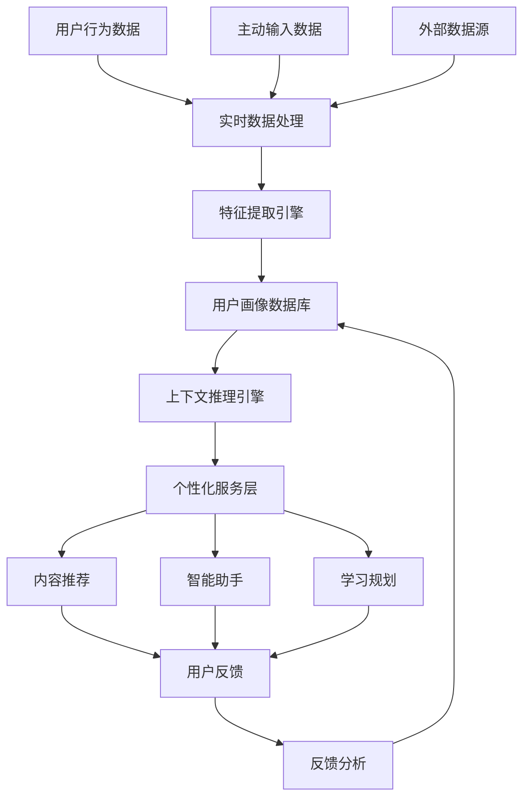

# 动态用户上下文系统设计

## 核心理念

第二大脑不仅要管理外部知识，更要深度理解"你是谁"，并随着你的成长而演进。这需要构建一个**动态用户画像引擎**，实现个人上下文的全息映射和实时更新。

---

## 一、全量上下文的初始构建

### 1.1 多维度用户画像框架

```yaml
个人画像维度:
  基础信息层:
    - 人口统计: 年龄、性别、地域、教育背景
    - 职业状态: 行业、职位、工作年限、技能栈
    - 生活状态: 家庭情况、兴趣爱好、生活节奏
  
  能力素质层:
    - 核心技能: 专业技能评级、软技能评估
    - 学习风格: 视觉/听觉/动手型、快速/深度型
    - 认知偏好: 分析型/直觉型、细节/大局观
  
  价值观念层:
    - 职业价值观: 成就导向/安全导向/关系导向
    - 决策风格: 理性/感性、保守/激进
    - 动机驱动: 内在动机vs外在激励
  
  行为模式层:
    - 工作习惯: 时间管理方式、协作偏好
    - 学习模式: 知识获取渠道、复习频率
    - 社交网络: 影响圈、信息来源、关键联系人
```

### 1.2 上下文采集策略

#### A. 主动画像建设（冷启动）
**结构化问卷调研**
```javascript
// 智能问卷示例
const profileQuestions = {
  skill_assessment: [
    {
      question: "请为你的以下技能打分(1-10)",
      skills: ["数据分析", "项目管理", "团队领导", "创新思维", "沟通表达"],
      format: "slider_rating"
    },
    {
      question: "你最近一年最有成就感的3个项目是什么？",
      format: "long_text",
      ai_analysis: "提取核心能力、成功模式、价值创造方式"
    }
  ],
  work_preference: [
    {
      question: "描述你理想的工作状态",
      follow_up: "AI追问工作环境、团队类型、挑战程度偏好"
    }
  ],
  learning_style: [
    {
      question: "你通常如何学习新知识？",
      options: ["阅读文档", "视频教程", "实践操作", "讨论交流"],
      format: "multiple_select"
    }
  ]
}
```

**专业能力测评**
- 使用AI驱动的能力评估工具
- 模拟工作场景的情境判断测试
- 基于历史作品的能力推断分析

#### B. 数字足迹分析（被动采集）
**工作行为数据**
```python
# 伪代码：工作模式分析
def analyze_work_patterns():
    # 日历分析
    calendar_data = get_calendar_events()
    work_rhythm = analyze_time_blocks(calendar_data)  # 深度工作时段
    meeting_pattern = analyze_meeting_frequency()     # 协作偏好
    
    # 文档创作分析
    documents = get_recent_documents()
    writing_style = analyze_content_style(documents)  # 沟通风格
    expertise_areas = extract_domain_knowledge()      # 专业领域
    
    # 邮件交互分析
    email_network = analyze_communication_network()   # 影响力圈层
    response_patterns = analyze_response_time()       # 工作节奏
    
    return {
        "work_rhythm": work_rhythm,
        "collaboration_style": meeting_pattern,
        "expertise_domains": expertise_areas,
        "influence_network": email_network
    }
```

**学习偏好挖掘**
```python
def extract_learning_preferences():
    # 内容消费分析
    reading_history = get_bookmarks_and_readings()
    content_types = categorize_content(reading_history)  # 偏好媒体类型
    
    # 笔记模式分析
    note_patterns = analyze_note_taking_style()         # 信息处理方式
    knowledge_connections = analyze_concept_linking()    # 思维模式
    
    # 搜索行为分析
    search_queries = get_search_history()
    curiosity_areas = identify_exploration_patterns()   # 兴趣演化
    
    return learning_profile
```

### 1.3 上下文数据结构

**个人知识图谱**
```cypher
// Neo4j图数据库结构示例
CREATE (person:Individual {name: "用户", id: "user_001"})

// 技能节点
CREATE (skill1:Skill {name: "Python编程", level: 8, verified: true})
CREATE (skill2:Skill {name: "产品策略", level: 7, verified: false})

// 关系定义
CREATE (person)-[:HAS_SKILL {proficiency: 8, last_used: "2024-06-01"}]->(skill1)
CREATE (person)-[:INTERESTED_IN {strength: 0.9}]->(domain:Domain {name: "人工智能"})

// 工作上下文
CREATE (job:Job {title: "产品经理", company: "TechCorp", start_date: "2023-01-01"})
CREATE (person)-[:WORKS_AS]->(job)

// 学习偏好
CREATE (person)-[:PREFERS {weight: 0.8}]->(style:LearningStyle {type: "hands_on"})
```

---

## 二、动态更新机制设计

### 2.1 多层次感知系统

#### 环境变化检测器
```python
class EnvironmentChangeDetector:
    def detect_life_changes(self):
        # 职业变化检测
        job_changes = self.detect_career_transitions()
        
        # 技能发展检测  
        skill_evolution = self.track_skill_progression()
        
        # 兴趣偏好变化
        interest_shifts = self.monitor_content_preferences()
        
        # 社交网络变化
        network_changes = self.analyze_relationship_evolution()
        
        return {
            "career": job_changes,
            "skills": skill_evolution, 
            "interests": interest_shifts,
            "network": network_changes
        }
    
    def detect_career_transitions(self):
        # 分析邮件标题、日历邀请、LinkedIn更新
        indicators = [
            "新公司邮箱域名出现",
            "职位相关关键词变化", 
            "新的会议类型和参与者",
            "学习内容主题转向"
        ]
        return self.analyze_indicators(indicators)
```

#### 能力成长追踪器
```python
class SkillGrowthTracker:
    def track_skill_development(self):
        # 项目成果分析
        recent_projects = self.get_recent_work()
        new_competencies = self.extract_demonstrated_skills(recent_projects)
        
        # 学习内容分析
        learning_materials = self.get_consumed_content()
        target_skills = self.infer_skill_intentions(learning_materials)
        
        # 同行反馈整合
        feedback_data = self.collect_peer_feedback()
        validated_growth = self.cross_validate_skills(feedback_data)
        
        return self.update_skill_profile(new_competencies, validated_growth)
```

### 2.2 智能更新触发机制

#### 主动更新触发器
```yaml
定期更新计划:
  月度回顾:
    - 触发: 每月1日自动
    - 内容: "这个月你有什么新的成长和变化？"
    - AI分析: 对比上月数据，识别显著变化
  
  季度深度回顾:
    - 触发: 每季度末
    - 内容: 全面能力重评估、目标调整
    - 输出: 更新个人发展路线图
  
  年度全面更新:
    - 触发: 年底或生日
    - 内容: 完整画像重构
    - 方式: 结合AI分析和深度访谈
```

#### 被动更新触发器
```python
class PassiveUpdateTriggers:
    def setup_change_monitors(self):
        # 1. 异常行为检测
        self.monitor_behavior_anomalies()  # 工作模式突变
        
        # 2. 内容主题漂移检测
        self.track_content_evolution()     # 阅读兴趣转移
        
        # 3. 社交网络变化检测
        self.observe_network_shifts()      # 新的联系人类型
        
        # 4. 成就里程碑检测
        self.detect_achievements()         # 项目完成、认证获得
    
    def behavior_anomaly_handler(self, anomaly):
        if anomaly.type == "work_pattern_shift":
            # 触发工作偏好更新问卷
            self.trigger_preference_update()
        elif anomaly.type == "learning_focus_change":
            # 更新技能发展目标
            self.update_skill_roadmap()
```

### 2.3 上下文版本管理

#### 个人画像版本控制
```python
class PersonalProfileVersioning:
    def __init__(self):
        self.profile_versions = []
        self.change_log = []
    
    def create_profile_snapshot(self, trigger_event):
        snapshot = {
            "version": f"v{len(self.profile_versions) + 1}",
            "timestamp": datetime.now(),
            "trigger": trigger_event,
            "profile_data": self.current_profile.copy(),
            "delta": self.calculate_changes()
        }
        
        self.profile_versions.append(snapshot)
        return snapshot
    
    def compare_profile_evolution(self, version_a, version_b):
        # 生成个人成长报告
        growth_analysis = {
            "skill_progression": self.analyze_skill_changes(),
            "interest_evolution": self.track_interest_shifts(), 
            "value_maturation": self.assess_value_changes(),
            "network_expansion": self.measure_network_growth()
        }
        return growth_analysis
```

---

## 三、上下文应用与反馈

### 3.1 个性化内容推荐

```python
class ContextAwareRecommendation:
    def recommend_content(self, user_context):
        # 基于当前状态推荐
        current_needs = self.infer_immediate_needs(user_context)
        
        # 基于成长轨迹推荐
        growth_opportunities = self.identify_development_gaps()
        
        # 基于同类人群推荐
        peer_insights = self.collaborative_filtering(user_context)
        
        return self.merge_recommendations([
            current_needs, growth_opportunities, peer_insights
        ])
    
    def personalize_learning_path(self):
        # 根据学习风格定制内容形式
        if user.learning_style == "visual":
            prioritize_media = ["infographics", "videos", "mind_maps"]
        elif user.learning_style == "analytical":
            prioritize_media = ["research_papers", "case_studies", "data_analysis"]
        
        return self.curate_content_by_style(prioritize_media)
```

### 3.2 智能工作助手

```python
class ContextAwareAssistant:
    def provide_contextual_help(self, task):
        # 调用个人上下文
        relevant_experience = self.find_similar_past_work(task)
        applicable_skills = self.match_required_skills(task)
        knowledge_gaps = self.identify_learning_needs(task)
        
        assistance = {
            "experience_leverage": relevant_experience,
            "skill_application": applicable_skills,
            "learning_suggestions": knowledge_gaps,
            "network_resources": self.suggest_expert_contacts(task)
        }
        
        return assistance
    
    def adaptive_communication_style(self, recipient):
        # 根据个人沟通偏好调整
        if self.user_profile.communication_style == "direct":
            tone = "concise_factual"
        elif self.user_profile.communication_style == "collaborative":
            tone = "inclusive_questioning"
            
        return self.adjust_message_tone(tone)
```

### 3.3 反馈循环机制

#### 隐式反馈收集
```python
class ImplicitFeedbackCollector:
    def collect_usage_signals(self):
        signals = {
            # 内容交互信号
            "reading_completion_rate": self.track_content_engagement(),
            "bookmark_patterns": self.analyze_saving_behavior(),
            "search_refinements": self.monitor_query_evolution(),
            
            # 推荐反馈信号  
            "recommendation_click_rate": self.measure_suggestion_adoption(),
            "task_completion_success": self.track_assistance_effectiveness(),
            
            # 工作流信号
            "feature_usage_frequency": self.monitor_tool_adoption(),
            "workflow_modifications": self.detect_process_changes()
        }
        
        return self.update_preferences_from_signals(signals)
```

#### 显式反馈机制
```yaml
反馈收集策略:
  微反馈:
    - 触发: 每次AI推荐后
    - 形式: 👍👎 + 可选简短原因
    - 频率: 高频低负担
  
  深度反馈:
    - 触发: 完成重要任务后
    - 形式: "这次AI助手哪里帮到了你？哪里还需要改进？"
    - 分析: 提取具体的上下文改进点
  
  画像校正:
    - 触发: AI判断与实际不符时
    - 形式: "AI似乎误解了你的偏好，请帮忙纠正"
    - 影响: 直接更新用户画像权重
```

---

## 四、技术实现架构

### 4.1 数据流架构



### 4.2 核心组件

#### 用户画像存储
```json
{
  "user_id": "user_001",
  "profile_version": "v2.3",
  "last_updated": "2024-06-07T10:30:00Z",
  
  "dimensions": {
    "skills": {
      "programming": {"level": 8, "confidence": 0.9, "last_validated": "2024-05-15"},
      "leadership": {"level": 6, "confidence": 0.7, "growth_trend": "increasing"}
    },
    
    "preferences": {
      "learning_style": ["hands_on", "collaborative"],
      "work_environment": "remote_first",
      "communication_style": "direct_analytical"
    },
    
    "context": {
      "current_role": "Senior Product Manager",
      "career_stage": "mid_senior",
      "focus_areas": ["AI产品", "用户增长", "团队管理"],
      "development_goals": ["技术深度", "战略思维"]
    }
  },
  
  "behavioral_patterns": {
    "work_rhythm": "deep_work_morning",
    "decision_making": "data_driven_with_intuition",
    "collaboration": "structured_meetings_async_work"
  },
  
  "change_indicators": {
    "skill_velocity": {"data_analysis": "accelerating"},
    "interest_drift": {"direction": "toward_ai_ethics"},
    "network_evolution": {"new_connections": "ai_researchers"}
  }
}
```

#### 更新触发引擎
```python
class UpdateTriggerEngine:
    def __init__(self):
        self.triggers = {
            "time_based": TimedTriggers(),
            "event_based": EventTriggers(), 
            "pattern_based": PatternTriggers(),
            "feedback_based": FeedbackTriggers()
        }
    
    def evaluate_update_necessity(self):
        scores = {}
        for trigger_type, trigger in self.triggers.items():
            scores[trigger_type] = trigger.calculate_urgency()
        
        # 加权决策是否触发更新
        if max(scores.values()) > self.update_threshold:
            return self.initiate_profile_update(scores)
        
        return None
```

---

## 五、实施路线图

### Phase 1: 基础画像构建 (2-3周)
1. **用户画像框架搭建**
   - 设计多维度画像模型
   - 创建结构化问卷系统
   - 建立基础数据采集流程

2. **初始数据收集**
   - 完成全面的画像调研问卷
   - 分析历史数字足迹数据
   - 建立个人知识图谱基础版

### Phase 2: 智能分析能力 (3-4周) 
1. **AI分析引擎集成**
   - 部署用户行为分析模型
   - 实现内容偏好推断算法
   - 建立技能成长追踪系统

2. **个性化推荐系统**
   - 基于画像的内容推荐
   - 智能学习路径规划
   - 上下文相关的工作助手

### Phase 3: 动态更新机制 (4-5周)
1. **变化检测系统**
   - 实现多维度变化感知
   - 建立异常行为检测
   - 设计智能更新触发器

2. **版本管理与追踪**
   - 画像版本控制系统
   - 成长轨迹可视化
   - 变化影响分析工具

### Phase 4: 反馈优化循环 (持续迭代)
1. **反馈机制完善**
   - 隐式反馈自动收集
   - 显式反馈界面优化
   - 反馈分析与应用闭环

2. **系统智能化提升**
   - 预测性个人发展建议
   - 主动式成长机会识别
   - 个性化AI助手调优

---

## 六、效果预期

### 短期效果 (1-3个月)
- **精准匹配**: 推荐内容准确率达到85%以上
- **效率提升**: 信息查找时间减少60%
- **个性化体验**: AI助手响应更贴合个人风格

### 中期效果 (3-12个月)  
- **成长加速**: 技能发展速度提升40%
- **决策优化**: 基于历史模式的更好决策建议
- **机会发现**: 主动识别职业发展机会

### 长期效果 (1年以上)
- **自我认知深化**: 通过数据洞察更了解自己
- **持续进化**: 系统与个人共同成长演进
- **智能协作**: 成为真正的认知伙伴和成长教练

---

这个动态用户上下文系统将让你的第二大脑真正"懂你"，并随着你的成长而不断进化，成为最贴合个人需求的智能助手。
