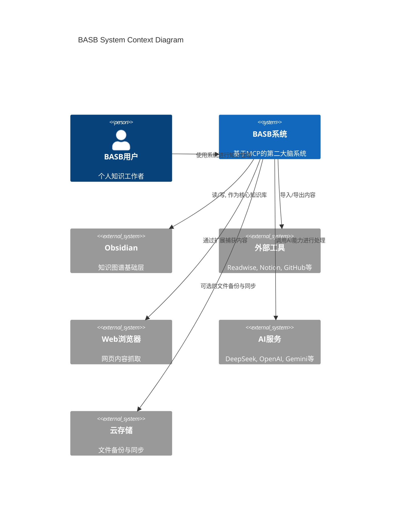
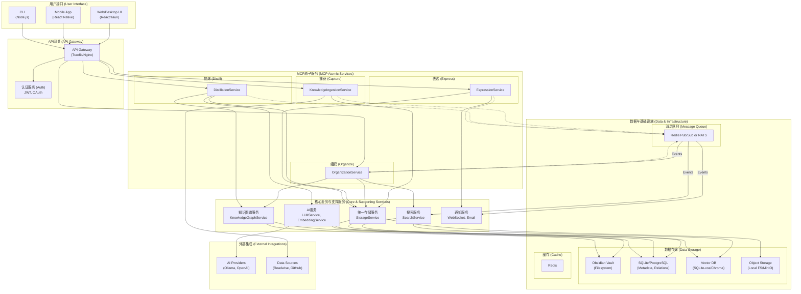

# BASB Architecture Design v1.3

## 文档信息
- **文档版本**: v1.3
- **创建日期**: 2024-12-19
- **更新日期**: 2024-12-22
- **创建者**: BASB System Architect
- **阶段**: Stage 2 - System Architecture Design
- **状态**: 架构设计优化，待详细设计
- **审核状态**: 待审核

## 1. 架构概述

### 1.1 架构愿景
构建一个以本地优先、轻量化、可扩展为核心原则的第二大脑（BASB）系统。该系统基于MCP（Modular Cognitive Protocol）原子服务，全面支持CODE（Capture, Organize, Distill, Express）知识管理框架，旨在为个人和小型团队提供一个安全、高效、智能的知识管理解决方案。

### 1.2 核心架构原则
- **本地优先 (Local-First)**: 所有核心数据和功能默认为本地存储和处理，确保用户数据的隐私和所有权。
- **轻量化与渐进式**: 提供从极简到专业的平滑升级路径，用户可根据需求逐步增强系统能力，避免不必要的资源消耗。
- **模块化与原子化**: 基于MCP协议，将功能拆分为独立的、可独立部署和升级的原子服务，提高系统的灵活性和可维护性。
- **事件驱动与异步通信**: 服务间通过异步消息传递解耦，提高系统的响应能力和弹性。
- **知识图谱核心**: 以知识图谱作为核心数据模型，连接和组织信息，实现深度知识关联和发现。
- **AI原生集成**: 将AI能力深度融入知识处理的各个环节，提升知识工作的效率和质量。

### 1.3 技术栈选择 (v1.3 优化)

为贯彻轻量化和本地优先原则，技术栈选择更注重资源友好和易于维护。

| 层次 | 极简版 (个人入门) | 标准版 (个人进阶) | 专业版 (小团队协作) |
| :--- | :--- | :--- | :--- |
| **部署方式** | 直接进程 (systemd/launchd) | Docker Compose | Docker + Traefik |
| **知识图谱** | Obsidian (本地Vault) | Obsidian + SQLite (关系扩展) | Obsidian + Neo4j (单节点) |
| **文档/元数据** | SQLite | PostgreSQL | PostgreSQL 集群 |
| **向量存储** | SQLite-vss (轻量级) | ChromaDB (本地) | Qdrant (高性能) |
| **文件存储** | 本地文件系统 | 本地 + 云备份 (rclone) | MinIO (本地对象存储) |
| **全文搜索** | SQLite FTS5 | Tantivy (Rust) | Meilisearch (高性能) |
| **AI-LLM** | 云端API (按需) | Ollama (本地) + 云端API | Ollama + AI网关 (智能路由) |
| **AI-Embedding**| CPU-based (Sentence-Transformers) | GPU/CPU (Sentence-Transformers) | 多模型支持 (本地+云端) |
| **消息队列** | 无 (进程内事件) | Redis Pub/Sub | RabbitMQ / NATS |
| **缓存** | 应用内存 | Redis | Redis (持久化) |
| **监控** | 结构化日志 | Uptime Kuma + 健康检查 | Prometheus + Grafana |

## 2. 系统架构设计

### 2.1 系统上下文图 (C4)

### 2.2 MCP服务架构图 (v1.3 优化)

## 3. MCP 原子服务实现细节

本章节详细描述核心 MCP 原子服务的具体实现方案和技术选型，旨在弥合当前占位符实现与需求文档之间的差距。

### 3.1 KnowledgeIngestionService (捕获服务)

- **核心职责**: 负责从各种来源捕获信息，并将其标准化为内部格式。
- **MCP工具**: 
  - `capture_webpage(url)`: 捕获网页内容。
  - `capture_note(content, format)`: 捕获文本笔记。
  - `capture_file(path)`: 捕获本地文件。
  - `import_from_readwise()`: 从Readwise导入高亮。
- **工作流**:
  1. 接收捕获请求。
  2. 调用相应的外部工具或内部处理器（如`unfurl`库解析URL）。
  3. 将原始内容转换为Markdown格式。
  4. 调用`StorageService`存储原始文件和Markdown文件。
  5. 发布`knowledge_item_created`事件到消息队列。
- **技术选型**: Rust (Actix Web), `reqwest` (HTTP客户端), `scraper` (HTML解析)。

### 3.2 OrganizationService (组织服务)

- **核心职责**: 对捕获的信息进行分类、打标签、建立关联，并更新知识图谱。
- **MCP工具**:
  - `set_tags(itemId, tags)`: 为知识条目设置标签。
  - `link_items(sourceId, targetId, relationship)`: 关联两个知识条目。
  - `move_to_folder(itemId, folderPath)`: 移动到指定PARA文件夹。
- **工作流**:
  1. 监听`knowledge_item_created`事件。
  2. (可选) 调用`AI_Service`进行自动打标或分类预测。
  3. 更新元数据（标签、分类）并存储到SQLite/PostgreSQL。
  4. 调用`KnowledgeGraphService`更新图谱关系。
  5. 调用`SearchService`为新条目建立索引。
- **技术选型**: Go (Gin), `gorm` (ORM)。

### 3.3 DistillationService (提炼服务)

- **核心职责**: 对信息进行深度处理，如总结、提取关键点、生成问答对等。
- **MCP工具**:
  - `summarize(itemId)`: 生成摘要。
  - `extract_key_points(itemId)`: 提取关键点。
  - `generate_qa(itemId)`: 生成问答对。
- **工作流**:
  1. 接收用户提炼请求或由自动化规则触发。
  2. 从`StorageService`获取内容。
  3. 调用`AI_Service`执行指定的提炼任务。
  4. 将提炼结果（如摘要）存储为新的笔记或附加到原笔记的元数据中。
  5. 发布`knowledge_item_distilled`事件。
- **技术选型**: Python (FastAPI), `langchain` (AI编排)。

### 3.4 ExpressionService (表达服务)

- **核心职责**: 将提炼后的知识以不同形式输出，如文章、演示文稿、社交媒体帖子等。
- **MCP工具**:
  - `generate_article(topic, keyPoints)`: 根据主题和要点生成文章。
  - `export_to_format(itemId, format)`: 导出为指定格式 (PDF, DOCX)。
  - `publish_to_platform(itemId, platform)`: 发布到外部平台 (Notion, Ghost)。
- **工作流**:
  1. 接收用户表达请求。
  2. 聚合相关的知识条目和提炼结果。
  3. (可选) 调用`AI_Service`进行内容生成或润色。
  4. 使用模板引擎（如Jinja2）生成最终输出。
  5. 调用`Notifier_Service`通知用户或直接发布。
- **技术选型**: Python (FastAPI), `pandoc` (格式转换)。