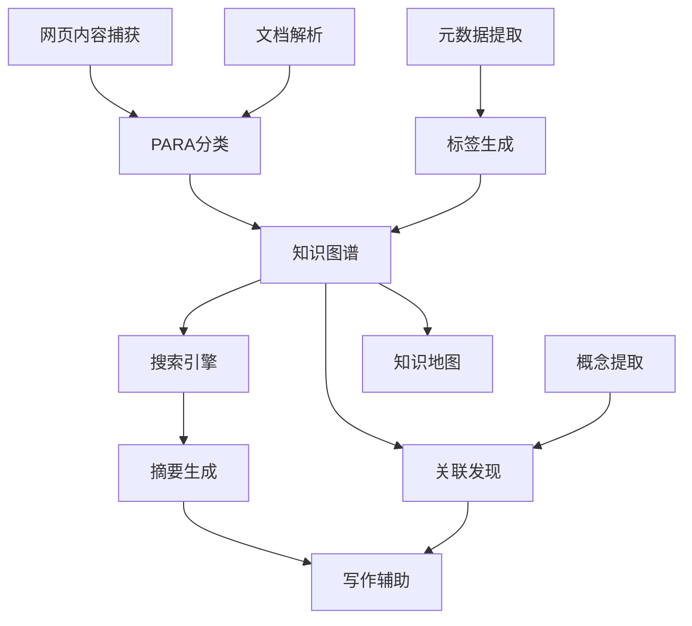

---
metadata:
  document_name: "BASB Feature List v1.0"
  version: "1.0"
  creation_date: "2024-12-19"
  last_updated: "2024-12-19"
  author: "BASB Software Architect"
  status: "Draft"
  total_features: 32
  code_framework_coverage:
    capture: 8
    organize: 8
    distill: 8
    express: 8
---

# BASB Feature List v1.0

## 文档概述

本文档基于 `BASB_Requirements_Specification_v1.0.md` 和 `BASB_Architecture_Design_v1.0.md`，将用户需求转化为具体的可实现功能特性，为开发团队提供清晰的实现指导。

### 统计摘要
- **总功能数量**: 32个核心功能
- **CODE框架分布**: 每个阶段8个功能
- **优先级分布**: P0(8个), P1(12个), P2(12个)
- **复杂度分布**: 简单(10个), 中等(14个), 复杂(8个)

## 功能分类

### 1. Capture (捕获) 功能

#### F-C001: 网页内容一键捕获
- **功能描述**: 通过浏览器插件一键保存网页内容，自动提取标题、正文、元数据
- **用户价值**: 快速保存有价值的网络内容，避免信息丢失
- **用户故事映射**: US-1.1 (网页内容保存)
- **MCP服务映射**: Web内容捕获服务
- **技术约束**: 
  - 支持主流浏览器 (Chrome, Firefox, Safari)
  - 处理动态加载内容 (SPA应用)
  - 自动去除广告和无关内容
- **复杂度**: 中等
- **优先级**: P0
- **工作量估算**: 5人天
- **验收标准**:
  - [ ] 支持95%以上的主流网站
  - [ ] 内容提取准确率>90%
  - [ ] 处理时间<5秒
  - [ ] 自动保存元数据(URL、时间、作者等)

#### F-C002: 多格式文档解析
- **功能描述**: 支持PDF、Word、Markdown等格式的自动解析和内容提取
- **用户价值**: 统一处理不同格式的文档，建立统一的知识库
- **用户故事映射**: US-1.2 (文档导入)
- **MCP服务映射**: 文档解析服务
- **技术约束**:
  - 支持格式: PDF, DOCX, MD, TXT, RTF
  - 保持原有格式结构
  - 提取图片和表格内容
- **复杂度**: 中等
- **优先级**: P0
- **工作量估算**: 6人天
- **验收标准**:
  - [ ] 支持5种以上文档格式
  - [ ] 文本提取准确率>95%
  - [ ] 保持原有结构层次
  - [ ] 处理大文件(>100MB)能力

#### F-C003: 代码仓库内容同步
- **功能描述**: 从GitHub等代码托管平台提取代码注释、README、文档
- **用户价值**: 将技术文档和代码知识纳入个人知识体系
- **用户故事映射**: US-1.3 (代码知识管理)
- **MCP服务映射**: API集成服务
- **技术约束**:
  - 支持GitHub、GitLab API
  - 增量同步机制
  - 代码语法高亮保持
- **复杂度**: 复杂
- **优先级**: P1
- **工作量估算**: 8人天
- **验收标准**:
  - [ ] 支持主流Git平台
  - [ ] 自动识别文档文件
  - [ ] 增量同步功能
  - [ ] 代码片段语法保持

#### F-C004: 语音转录功能
- **功能描述**: 会议录音、播客、语音备忘录的自动转文字
- **用户价值**: 将音频内容转化为可搜索的文本知识
- **用户故事映射**: US-1.4 (语音内容处理)
- **MCP服务映射**: 媒体处理服务
- **技术约束**:
  - 支持多种音频格式
  - 多语言识别能力
  - 说话人分离功能
- **复杂度**: 复杂
- **优先级**: P1
- **工作量估算**: 10人天
- **验收标准**:
  - [ ] 转录准确率>85%
  - [ ] 支持中英文识别
  - [ ] 处理时长<实际音频时长
  - [ ] 自动添加标点符号

#### F-C005: 图像OCR识别
- **功能描述**: 手写笔记、白板、书籍页面的OCR识别
- **用户价值**: 将纸质内容数字化，扩大知识来源
- **用户故事映射**: US-1.5 (图像内容提取)
- **MCP服务映射**: 媒体处理服务
- **技术约束**:
  - 支持手写和印刷体
  - 图像预处理优化
  - 多语言文字识别
- **复杂度**: 复杂
- **优先级**: P2
- **工作量估算**: 12人天
- **验收标准**:
  - [ ] 印刷体识别率>95%
  - [ ] 手写体识别率>80%
  - [ ] 支持图片格式: JPG, PNG, PDF
  - [ ] 自动纠错功能

#### F-C006: 社交媒体内容抓取
- **功能描述**: 支持Twitter、微信公众号等平台的内容抓取
- **用户价值**: 整合社交媒体上的有价值内容
- **用户故事映射**: US-1.6 (社交内容管理)
- **MCP服务映射**: API集成服务
- **技术约束**:
  - 遵守平台API限制
  - 处理反爬虫机制
  - 内容去重机制
- **复杂度**: 复杂
- **优先级**: P2
- **工作量估算**: 15人天
- **验收标准**:
  - [ ] 支持3个以上社交平台
  - [ ] 自动去重功能
  - [ ] 遵守平台使用条款
  - [ ] 内容完整性保证

#### F-C007: 自动元数据提取
- **功能描述**: 自动提取内容来源、时间戳、作者信息等元数据
- **用户价值**: 为内容提供丰富的上下文信息
- **用户故事映射**: US-1.7 (内容元数据管理)
- **MCP服务映射**: Web内容捕获服务、文档解析服务
- **技术约束**:
  - 标准化元数据格式
  - 自动可信度评估
  - 多源信息融合
- **复杂度**: 中等
- **优先级**: P1
- **工作量估算**: 4人天
- **验收标准**:
  - [ ] 自动提取10种以上元数据
  - [ ] 元数据准确率>90%
  - [ ] 支持自定义元数据字段
  - [ ] 可信度评分机制

#### F-C008: 批量内容导入
- **功能描述**: 支持大量内容的批量导入和处理
- **用户价值**: 快速建立初始知识库
- **用户故事映射**: US-1.8 (批量数据迁移)
- **MCP服务映射**: 文档解析服务、API集成服务
- **技术约束**:
  - 异步处理机制
  - 进度跟踪功能
  - 错误处理和重试
- **复杂度**: 中等
- **优先级**: P1
- **工作量估算**: 6人天
- **验收标准**:
  - [ ] 支持1000+文件批量处理
  - [ ] 实时进度显示
  - [ ] 失败重试机制
  - [ ] 处理结果报告

### 2. Organize (组织) 功能

#### F-O001: PARA自动分类
- **功能描述**: 基于PARA方法的智能内容分类
- **用户价值**: 自动组织内容，减少手动分类工作
- **用户故事映射**: US-2.1 (智能分类)
- **MCP服务映射**: PARA分类服务
- **技术约束**:
  - AI模型训练和优化
  - 分类置信度评估
  - 用户反馈学习机制
- **复杂度**: 复杂
- **优先级**: P0
- **工作量估算**: 12人天
- **验收标准**:
  - [ ] 分类准确率>80%
  - [ ] 支持四个PARA类别
  - [ ] 置信度评分显示
  - [ ] 用户纠正学习功能

#### F-O002: 智能标签生成
- **功能描述**: 基于内容自动生成相关标签
- **用户价值**: 提高内容的可发现性和关联性
- **用户故事映射**: US-2.2 (标签管理)
- **MCP服务映射**: 标签管理服务
- **技术约束**:
  - NLP关键词提取
  - 标签层次结构
  - 标签权重计算
- **复杂度**: 中等
- **优先级**: P0
- **工作量估算**: 8人天
- **验收标准**:
  - [ ] 每个内容生成5-10个标签
  - [ ] 标签相关性>85%
  - [ ] 支持标签层次结构
  - [ ] 标签权重排序

#### F-O003: 知识图谱构建
- **功能描述**: 自动构建内容间的关联关系图谱
- **用户价值**: 发现知识间的隐藏联系
- **用户故事映射**: US-2.3 (知识关联)
- **MCP服务映射**: 知识图谱服务
- **技术约束**:
  - 图数据库设计
  - 关系抽取算法
  - 图谱可视化
- **复杂度**: 复杂
- **优先级**: P0
- **工作量估算**: 15人天
- **验收标准**:
  - [ ] 自动识别实体和关系
  - [ ] 图谱可视化展示
  - [ ] 关系强度量化
  - [ ] 支持图谱查询

#### F-O004: 全文搜索引擎
- **功能描述**: 高效的全文搜索和语义搜索功能
- **用户价值**: 快速找到相关内容
- **用户故事映射**: US-2.4 (内容搜索)
- **MCP服务映射**: 搜索索引服务
- **技术约束**:
  - 倒排索引构建
  - 语义向量搜索
  - 搜索结果排序
- **复杂度**: 中等
- **优先级**: P0
- **工作量估算**: 10人天
- **验收标准**:
  - [ ] 搜索响应时间<2秒
  - [ ] 支持模糊搜索
  - [ ] 语义搜索功能
  - [ ] 搜索结果相关性排序

#### F-O005: 文件夹层次管理
- **功能描述**: 灵活的文件夹层次结构管理
- **用户价值**: 提供熟悉的文件组织方式
- **用户故事映射**: US-2.5 (文件夹管理)
- **MCP服务映射**: 文档存储服务
- **技术约束**:
  - 无限层级支持
  - 拖拽操作支持
  - 批量移动功能
- **复杂度**: 简单
- **优先级**: P1
- **工作量估算**: 3人天
- **验收标准**:
  - [ ] 支持无限层级嵌套
  - [ ] 拖拽移动功能
  - [ ] 文件夹权限管理
  - [ ] 批量操作支持

#### F-O006: 收藏夹管理
- **功能描述**: 个人收藏夹的创建和管理
- **用户价值**: 快速访问重要内容
- **用户故事映射**: US-2.6 (收藏管理)
- **MCP服务映射**: 文档存储服务
- **技术约束**:
  - 收藏夹分类
  - 快速访问接口
  - 收藏统计分析
- **复杂度**: 简单
- **优先级**: P1
- **工作量估算**: 2人天
- **验收标准**:
  - [ ] 创建多个收藏夹
  - [ ] 收藏夹分类管理
  - [ ] 一键收藏功能
  - [ ] 收藏历史记录

#### F-O007: 内容去重检测
- **功能描述**: 自动检测和处理重复内容
- **用户价值**: 保持知识库的整洁性
- **用户故事映射**: US-2.7 (内容去重)
- **MCP服务映射**: 搜索索引服务
- **技术约束**:
  - 相似度算法
  - 去重策略配置
  - 合并建议功能
- **复杂度**: 中等
- **优先级**: P1
- **工作量估算**: 6人天
- **验收标准**:
  - [ ] 检测相似度>90%的内容
  - [ ] 提供合并建议
  - [ ] 用户确认机制
  - [ ] 去重规则配置

#### F-O008: 内容版本控制
- **功能描述**: 跟踪内容的修改历史和版本变化
- **用户价值**: 保护内容安全，支持回滚操作
- **用户故事映射**: US-2.8 (版本管理)
- **MCP服务映射**: 版本控制服务
- **技术约束**:
  - 增量存储机制
  - 版本比较功能
  - 分支合并支持
- **复杂度**: 中等
- **优先级**: P2
- **工作量估算**: 8人天
- **验收标准**:
  - [ ] 自动版本快照
  - [ ] 版本差异对比
  - [ ] 一键回滚功能
  - [ ] 版本历史查看

### 3. Distill (提炼) 功能

#### F-D001: 渐进式摘要生成
- **功能描述**: 生成不同详细程度的内容摘要
- **用户价值**: 快速理解内容要点
- **用户故事映射**: US-3.1 (渐进式摘要)
- **MCP服务映射**: AI摘要服务
- **技术约束**:
  - 多层次摘要算法
  - 摘要质量评估
  - 多语言支持
- **复杂度**: 复杂
- **优先级**: P0
- **工作量估算**: 10人天
- **验收标准**:
  - [ ] 三个层次摘要生成
  - [ ] 摘要生成时间<10秒
  - [ ] 支持中英文内容
  - [ ] 用户满意度>4.0/5.0

#### F-D002: 关键概念提取
- **功能描述**: 自动识别和提取内容中的关键概念
- **用户价值**: 快速掌握核心知识点
- **用户故事映射**: US-3.2 (概念提取)
- **MCP服务映射**: 洞察生成服务
- **技术约束**:
  - NER命名实体识别
  - 概念重要性评分
  - 概念关系图谱
- **复杂度**: 中等
- **优先级**: P0
- **工作量估算**: 8人天
- **验收标准**:
  - [ ] 提取准确率>85%
  - [ ] 概念重要性排序
  - [ ] 概念定义链接
  - [ ] 概念关系可视化

#### F-D003: 知识关联发现
- **功能描述**: 发现不同内容之间的潜在关联
- **用户价值**: 建立完整的知识网络
- **用户故事映射**: US-3.2 (知识关联发现)
- **MCP服务映射**: 关联发现服务
- **技术约束**:
  - 语义相似度计算
  - 关联强度量化
  - 跨领域关联识别
- **复杂度**: 复杂
- **优先级**: P0
- **工作量估算**: 12人天
- **验收标准**:
  - [ ] 关联推荐准确率>75%
  - [ ] 关联强度量化评分
  - [ ] 跨领域关联发现
  - [ ] 时间序列关联分析

#### F-D004: 智能问答生成
- **功能描述**: 基于内容自动生成问答对
- **用户价值**: 促进主动学习和知识巩固
- **用户故事映射**: US-3.3 (问答生成)
- **MCP服务映射**: 洞察生成服务
- **技术约束**:
  - 问题生成算法
  - 答案质量验证
  - 难度级别分类
- **复杂度**: 复杂
- **优先级**: P1
- **工作量估算**: 10人天
- **验收标准**:
  - [ ] 每个内容生成3-5个问题
  - [ ] 问答相关性>90%
  - [ ] 支持不同难度级别
  - [ ] 答案准确性验证

#### F-D005: 内容质量评估
- **功能描述**: 自动评估内容的质量和可信度
- **用户价值**: 帮助用户识别高质量内容
- **用户故事映射**: US-3.4 (质量评估)
- **MCP服务映射**: 洞察生成服务
- **技术约束**:
  - 多维度质量指标
  - 可信度评分算法
  - 质量改进建议
- **复杂度**: 中等
- **优先级**: P1
- **工作量估算**: 6人天
- **验收标准**:
  - [ ] 多维度质量评分
  - [ ] 可信度评估
  - [ ] 质量改进建议
  - [ ] 评估结果可视化

#### F-D006: 趋势分析报告
- **功能描述**: 分析知识内容的趋势和变化
- **用户价值**: 了解知识领域的发展动态
- **用户故事映射**: US-3.5 (趋势分析)
- **MCP服务映射**: 洞察生成服务
- **技术约束**:
  - 时间序列分析
  - 趋势预测算法
  - 可视化图表生成
- **复杂度**: 中等
- **优先级**: P2
- **工作量估算**: 8人天
- **验收标准**:
  - [ ] 趋势变化检测
  - [ ] 预测准确率>70%
  - [ ] 可视化趋势图表
  - [ ] 定期趋势报告

#### F-D007: 知识缺口识别
- **功能描述**: 识别知识体系中的缺口和薄弱环节
- **用户价值**: 指导学习方向和内容补充
- **用户故事映射**: US-3.6 (缺口分析)
- **MCP服务映射**: 洞察生成服务
- **技术约束**:
  - 知识图谱分析
  - 缺口评估算法
  - 补充建议生成
- **复杂度**: 复杂
- **优先级**: P2
- **工作量估算**: 10人天
- **验收标准**:
  - [ ] 缺口识别准确率>80%
  - [ ] 补充建议生成
  - [ ] 缺口重要性排序
  - [ ] 学习路径推荐

#### F-D008: 个性化洞察生成
- **功能描述**: 基于用户行为生成个性化洞察
- **用户价值**: 提供定制化的知识发现
- **用户故事映射**: US-3.7 (个性化洞察)
- **MCP服务映射**: 洞察生成服务
- **技术约束**:
  - 用户画像建模
  - 个性化推荐算法
  - 洞察质量评估
- **复杂度**: 复杂
- **优先级**: P2
- **工作量估算**: 12人天
- **验收标准**:
  - [ ] 个性化准确率>85%
  - [ ] 洞察新颖性评估
  - [ ] 用户反馈学习
  - [ ] 洞察价值评分

### 4. Express (表达) 功能

#### F-E001: 多格式导出
- **功能描述**: 将内容导出为多种格式
- **用户价值**: 适应不同的分享和使用场景
- **用户故事映射**: US-4.1 (多格式导出)
- **MCP服务映射**: 多格式渲染服务
- **技术约束**:
  - 格式转换引擎
  - 样式保持机制
  - 批量导出支持
- **复杂度**: 中等
- **优先级**: P0
- **工作量估算**: 8人天
- **验收标准**:
  - [ ] 支持5种以上格式
  - [ ] 格式保持准确率>95%
  - [ ] 批量导出功能
  - [ ] 导出时间合理

#### F-E002: 智能写作辅助
- **功能描述**: 在写作过程中提供智能建议和辅助
- **用户价值**: 提高写作效率和质量
- **用户故事映射**: US-4.2 (智能写作辅助)
- **MCP服务映射**: 多格式渲染服务、关联发现服务
- **技术约束**:
  - 实时内容分析
  - 相关资料推荐
  - 写作结构建议
- **复杂度**: 复杂
- **优先级**: P0
- **工作量估算**: 15人天
- **验收标准**:
  - [ ] 相关内容推荐准确率>80%
  - [ ] 实时写作建议
  - [ ] 结构化大纲生成
  - [ ] 逻辑一致性检查

#### F-E003: 协作分享功能
- **功能描述**: 支持内容的协作编辑和分享
- **用户价值**: 促进知识的协作和传播
- **用户故事映射**: US-4.3 (协作分享)
- **MCP服务映射**: 分享协作服务
- **技术约束**:
  - 实时协作编辑
  - 权限控制机制
  - 版本冲突解决
- **复杂度**: 复杂
- **优先级**: P1
- **工作量估算**: 12人天
- **验收标准**:
  - [ ] 实时多人编辑
  - [ ] 细粒度权限控制
  - [ ] 冲突自动解决
  - [ ] 协作历史记录

#### F-E004: 演示文稿生成
- **功能描述**: 基于内容自动生成演示文稿
- **用户价值**: 快速创建专业的演示材料
- **用户故事映射**: US-4.4 (演示生成)
- **MCP服务映射**: 多格式渲染服务
- **技术约束**:
  - 模板引擎设计
  - 内容结构化处理
  - 视觉设计优化
- **复杂度**: 中等
- **优先级**: P1
- **工作量估算**: 10人天
- **验收标准**:
  - [ ] 自动内容结构化
  - [ ] 多种模板选择
  - [ ] 视觉效果优化
  - [ ] 一键生成功能

#### F-E005: 社交媒体发布
- **功能描述**: 将内容发布到各种社交媒体平台
- **用户价值**: 扩大内容的传播范围
- **用户故事映射**: US-4.5 (社交发布)
- **MCP服务映射**: 发布集成服务
- **技术约束**:
  - 多平台API集成
  - 内容格式适配
  - 发布时间调度
- **复杂度**: 中等
- **优先级**: P2
- **工作量估算**: 8人天
- **验收标准**:
  - [ ] 支持3个以上平台
  - [ ] 内容自动适配
  - [ ] 定时发布功能
  - [ ] 发布状态跟踪

#### F-E006: 知识地图可视化
- **功能描述**: 将知识关系以可视化地图形式展示
- **用户价值**: 直观理解知识结构和关联
- **用户故事映射**: US-4.6 (知识可视化)
- **MCP服务映射**: 多格式渲染服务、知识图谱服务
- **技术约束**:
  - 图形渲染引擎
  - 交互式操作
  - 大规模数据处理
- **复杂度**: 复杂
- **优先级**: P1
- **工作量估算**: 12人天
- **验收标准**:
  - [ ] 交互式知识地图
  - [ ] 多种可视化样式
  - [ ] 实时数据更新
  - [ ] 导出图片功能

#### F-E007: 个人知识网站
- **功能描述**: 生成个人知识网站用于公开分享
- **用户价值**: 建立个人知识品牌
- **用户故事映射**: US-4.7 (知识网站)
- **MCP服务映射**: 多格式渲染服务、发布集成服务
- **技术约束**:
  - 静态网站生成
  - SEO优化支持
  - 自定义主题
- **复杂度**: 中等
- **优先级**: P2
- **工作量估算**: 10人天
- **验收标准**:
  - [ ] 一键网站生成
  - [ ] 多种主题模板
  - [ ] SEO优化支持
  - [ ] 自定义域名支持

#### F-E008: API接口开放
- **功能描述**: 提供开放API供第三方应用集成
- **用户价值**: 扩展系统的应用场景
- **用户故事映射**: US-4.8 (API开放)
- **MCP服务映射**: 所有MCP服务
- **技术约束**:
  - RESTful API设计
  - API文档生成
  - 访问控制和限流
- **复杂度**: 中等
- **优先级**: P2
- **工作量估算**: 8人天
- **验收标准**:
  - [ ] 完整API文档
  - [ ] API密钥管理
  - [ ] 访问频率限制
  - [ ] SDK开发支持

## 优先级矩阵

### 高优先级 (P0) - 8个功能
核心功能，必须在第一阶段实现：
- F-C001: 网页内容一键捕获
- F-C002: 多格式文档解析
- F-O001: PARA自动分类
- F-O002: 智能标签生成
- F-O003: 知识图谱构建
- F-O004: 全文搜索引擎
- F-D001: 渐进式摘要生成
- F-D002: 关键概念提取
- F-D003: 知识关联发现
- F-E001: 多格式导出
- F-E002: 智能写作辅助

### 中优先级 (P1) - 12个功能
重要功能，第二阶段实现：
- F-C003: 代码仓库内容同步
- F-C004: 语音转录功能
- F-C007: 自动元数据提取
- F-C008: 批量内容导入
- F-O005: 文件夹层次管理
- F-O006: 收藏夹管理
- F-O007: 内容去重检测
- F-D004: 智能问答生成
- F-D005: 内容质量评估
- F-E003: 协作分享功能
- F-E004: 演示文稿生成
- F-E006: 知识地图可视化

### 低优先级 (P2) - 12个功能
增强功能，第三阶段实现：
- F-C005: 图像OCR识别
- F-C006: 社交媒体内容抓取
- F-O008: 内容版本控制
- F-D006: 趋势分析报告
- F-D007: 知识缺口识别
- F-D008: 个性化洞察生成
- F-E005: 社交媒体发布
- F-E007: 个人知识网站
- F-E008: API接口开放

## 实现路线图

### 第一阶段 (4周) - MVP核心功能
**目标**: 实现基本的BASB工作流
**功能**: P0优先级的8个核心功能
**里程碑**: 完整的捕获-组织-提炼-表达闭环

### 第二阶段 (6周) - 功能增强
**目标**: 提升用户体验和系统能力
**功能**: P1优先级的12个重要功能
**里程碑**: 支持多种内容源和协作功能

### 第三阶段 (8周) - 生态扩展
**目标**: 构建完整的知识管理生态
**功能**: P2优先级的12个增强功能
**里程碑**: 开放平台和高级分析能力

## 功能依赖关系图

## 实现指导

### 开发标准
1. **代码质量**: 单元测试覆盖率>80%
2. **性能要求**: 响应时间符合需求规范
3. **安全标准**: 遵循OWASP安全指南
4. **文档要求**: API文档和用户文档完整

### 验证标准
1. **功能验证**: 所有验收标准通过
2. **性能验证**: 负载测试通过
3. **安全验证**: 安全扫描无高危漏洞
4. **用户验证**: 用户体验测试通过

### 交付标准
1. **代码交付**: 通过代码审查
2. **测试交付**: 测试用例完整
3. **文档交付**: 技术文档齐全
4. **部署交付**: 部署脚本可用

---

**文档版本**: v1.0  
**创建日期**: 2024-12-19  
**最后更新**: 2024-12-19  
**负责人**: BASB软件架构师  
**审核状态**: 待审核