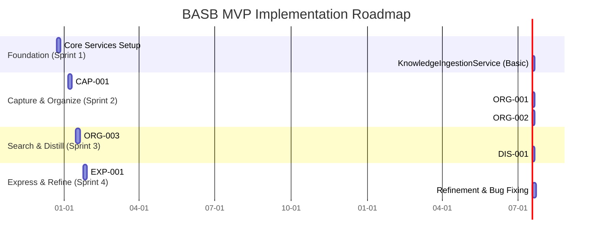

# BASB Feature List v1.2

## 文档信息
- **文档版本**: v1.2
- **生成日期**: 2024-12-21
- **统计摘要**: 
  - 总特性数: 16
  - Capture特性: 4
  - Organize特性: 4
  - Distill特性: 4
  - Express特性: 4

## 1. 特性分类 (按CODE框架)

### 1.1 Capture (捕获)

| ID | 名称 | 描述 | 用户故事映射 | MCP服务 | 复杂度 | 优先级 |
|---|---|---|---|---|---|---|
| CAP-001 | 网页内容捕获 | 从URL捕获网页主要内容，去除广告和无关元素。 | US-001 | KnowledgeIngestionService | 中 | 高 |
| CAP-002 | 本地文档解析 | 解析本地上传的 `.md`, `.txt`, `.pdf` 文件。 | US-002 | KnowledgeIngestionService | 中 | 高 |
| CAP-003 | 媒体文件处理 | 对图片进行OCR文字识别。 | US-003 | KnowledgeIngestionService | 高 | 中 |
| CAP-004 | 外部数据同步 | 从Readwise等外部服务同步高亮和笔记。 | US-004 | KnowledgeIngestionService | 高 | 中 |

### 1.2 Organize (组织)

| ID | 名称 | 描述 | 用户故事映射 | MCP服务 | 复杂度 | 优先级 |
|---|---|---|---|---|---|---|
| ORG-001 | 智能内容分类 | 使用AI自动将内容归类到PARA结构中。 | US-005 | OrganizationService | 中 | 高 |
| ORG-002 | 标签管理与推荐 | 添加、删除、重命名标签，并获得AI推荐。 | US-006 | OrganizationService | 中 | 高 |
| ORG-003 | 全文搜索 | 对所有知识内容进行快速、准确的全文搜索。 | US-007 | ISearchService | 高 | 高 |
| ORG-004 | 知识图谱构建 | 自动构建和可视化笔记间的链接关系。 | US-008 | IKnowledgeGraphService | 高 | 高 |

### 1.3 Distill (提炼)

| ID | 名称 | 描述 | 用户故事映射 | MCP服务 | 复杂度 | 优先级 |
|---|---|---|---|---|---|---|
| DIS-001 | AI自动摘要 | 为长篇内容生成简洁的摘要。 | US-009 | DistillationService | 中 | 高 |
| DIS-002 | 关键元素提取 | 从内容中提取关键定义、引言和数据点。 | US-010 | DistillationService | 中 | 中 |
| DIS-003 | 潜在链接发现 | 推荐相关笔记，发现隐藏的知识联系。 | US-011 | DistillationService | 高 | 中 |
| DIS-004 | 渐进式总结 | 支持用户通过高亮逐步形成自己的总结。 | US-012 | DistillationService | 中 | 低 |

### 1.4 Express (表达)

| ID | 名称 | 描述 | 用户故事映射 | MCP服务 | 复杂度 | 优先级 |
|---|---|---|---|---|---|---|
| EXP-001 | 笔记导出 | 将笔记导出为 `.md`, `.pdf`, `.html` 格式。 | US-013 | ExpressionService | 中 | 高 |
| EXP-002 | 内容发布 | 将笔记一键发布到博客或Notion等平台。 | US-014 | ExpressionService | 高 | 中 |
| EXP-003 | 分享与协作 | 生成可分享的链接，并支持简单的评论功能。 | US-015 | ExpressionService | 高 | 低 |
| EXP-004 | 模板化内容生成 | 使用预设模板快速创建结构化内容。 | US-016 | ExpressionService | 中 | 中 |

## 2. 优先级矩阵

| | 低复杂度 | 中复杂度 | 高复杂度 |
|---|---|---|---|
| **高优先级** | | CAP-001, ORG-001, ORG-002, DIS-001, EXP-001 | ORG-003, ORG-004 |
| **中优先级** | | DIS-002, DIS-004, EXP-004 | CAP-003, CAP-004, DIS-003, EXP-002 |
| **低优先级** | | | EXP-003 |

## 3. 实现指南

### 3.1 实现标准
- **代码质量**: 遵循ESLint规范，测试覆盖率 > 85%。
- **文档**: 所有公共API和复杂逻辑需有JSDoc注释。
- **性能**: 关键路径操作响应时间 < 500ms。
- **安全性**: 所有外部输入必须经过验证和清理。

### 3.2 验证标准
- **单元测试**: 覆盖所有业务逻辑分支。
- **集成测试**: 验证服务间的交互符合预期。
- **端到端测试**: 模拟用户真实操作场景。
- **验收标准**: 必须满足对应用户故事的验收条件。

## 4. 特性依赖关系图 (v1.2)

```mermaid
graph TD
    subgraph "基础服务 (Core Services)"
        Storage["IStorageService"] --> DB[(PostgreSQL & MinIO)]
        Search["ISearchService"] --> VectorDB[(Vector DB)]
        KG["IKnowledgeGraphService"] --> Obsidian[(Obsidian Vault)]
        AI["ILLMService"] --> ExtAI[(External AI Providers)]
    end

    subgraph "Capture (捕获)"
        CAP001["CAP-001: 网页捕获"] --> Storage
        CAP002["CAP-002: 文档解析"] --> Storage
        CAP003["CAP-003: 媒体处理"] --> Storage & AI
        CAP004["CAP-004: 外部同步"] --> Storage
    end

    subgraph "Organize (组织)"
        ORG001["ORG-001: 智能分类"] --> AI & KG
        ORG002["ORG-002: 标签管理"] --> Storage & AI
        ORG003["ORG-003: 全文搜索"] --> Search
        ORG004["ORG-004: 图谱构建"] --> KG
    end

    subgraph "Distill (提炼)"
        DIS001["DIS-001: AI摘要"] --> AI
        DIS002["DIS-002: 元素提取"] --> AI
        DIS003["DIS-003: 链接发现"] --> AI & KG
        DIS004["DIS-004: 渐进式总结"] --> Storage
    end

    subgraph "Express (表达)"
        EXP001["EXP-001: 笔记导出"] --> Storage
        EXP002["EXP-002: 内容发布"] --> Storage
        EXP003["EXP-003: 分享协作"] --> Storage
        EXP004["EXP-004: 模板生成"] --> Storage
    end

    %% 跨阶段依赖
    ORG001 --> CAP001 & CAP002 & CAP003 & CAP004
    ORG003 --> CAP001 & CAP002 & CAP003 & CAP004
    DIS001 --> CAP001 & CAP002

    classDef cap fill:#f9f,stroke:#333,stroke-width:2px;
    classDef org fill:#9cf,stroke:#333,stroke-width:2px;
    classDef dis fill:#9fc,stroke:#333,stroke-width:2px;
    classDef exp fill:#fc9,stroke:#333,stroke-width:2px;
    classDef core fill:#ccc,stroke:#333,stroke-width:2px;

    class CAP001,CAP002,CAP003,CAP004 cap;
    class ORG001,ORG002,ORG003,ORG004 org;
    class DIS001,DIS002,DIS003,DIS004 dis;
    class EXP001,EXP002,EXP003,EXP004 exp;
    class Storage,Search,KG,AI,DB,VectorDB,Obsidian,ExtAI core;
```

## 5. 实现路线图

