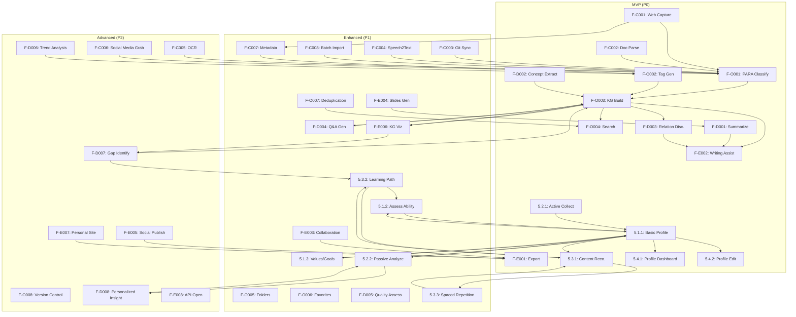

# BASB Feature List v1.2

## 文档元数据
- **文档版本**: v1.2
- **基于架构文档**: BASB_Architecture_Design_v1.2.md
- **创建日期**: 2024-12-19 (原始 v1.0)
- **最后更新**: {{CURRENT_DATE}} (由AI助手根据v1.2架构文档更新)
- **负责人**: BASB软件架构师
- **审核状态**: 待审核

## 文档概述
本文档详细列出了构建第二大脑 (BASB) 系统的功能特性，旨在为开发团队提供清晰的实现指导。特性根据CODE方法论 (Capture, Organize, Distill, Express) 和用户画像与个性化进行分类，并包含优先级、复杂度、工作量估算和验收标准。

## 1. Feature Classification (特性分类)

### 1.1 Capture (捕获) 功能

#### F-C001: 网页内容一键捕获
- **功能描述**: 用户可以通过浏览器扩展一键捕获网页的完整内容、选定区域或核心文本。
- **用户价值**: 快速保存有价值的在线信息，避免信息丢失。
- **用户故事映射**: US-1.1 (网页捕获)
- **MCP服务映射**: `KnowledgeIngestionService.captureWebContent`, `WebCaptureService` (前端组件/浏览器扩展交互)
- **技术约束**:
  - 浏览器扩展技术 (Chrome, Firefox, Edge)
  - HTML解析与内容提取库 (e.g., Readability.js, Mercury Parser)
  - DOM操作与截图技术
  - DeepSeek/Ollama (用于智能内容区域识别、初步摘要)
  - Markdown转换
- **复杂度**: 中等
- **优先级**: P0
- **工作量估算**: 5人天
- **验收标准**:
  - [ ] 支持主流浏览器
  - [ ] 捕获内容准确率>95%
  - [ ] 支持多种捕获模式
  - [ ] 捕获速度<3秒

#### F-C002: 多格式文档解析
- **功能描述**: 系统支持解析多种格式的本地文档，如PDF, Word, Excel, PowerPoint, Markdown, TXT等。
- **用户价值**: 整合用户已有的各种格式的数字资产。
- **用户故事映射**: US-1.2 (文档解析)
- **MCP服务映射**: `KnowledgeIngestionService.parseDocument`, `FileCaptureService`
- **技术约束**:
  - 文档解析库 (e.g., Apache Tika, Pandoc, Mammoth.js for DOCX, pdf.js for PDF)
  - 文本提取与结构化处理
  - 元数据提取 (作者、创建日期等)
  - DeepSeek/Ollama (用于复杂文档结构理解、内容摘要)
  - 字符编码处理 (UTF-8, GBK等)
- **复杂度**: 中等
- **优先级**: P0
- **工作量估算**: 6人天
- **验收标准**:
  - [ ] 支持至少5种主流文档格式
  - [ ] 解析内容完整性>98%
  - [ ] 保留基本格式信息
  - [ ] 解析速度满足用户体验

#### F-C003: 代码仓库内容同步
- **功能描述**: 支持连接并同步Git代码仓库中的Markdown文档、代码片段和Issue讨论。
- **用户价值**: 将代码相关的知识沉淀到第二大脑中。
- **用户故事映射**: US-1.3 (代码同步)
- **MCP服务映射**: `KnowledgeIngestionService.syncExternalData` (Git模块)
- **技术约束**:
  - Git API集成 (GitHub, GitLab, Bitbucket)
  - OAuth2认证
  - Webhook事件处理
  - Markdown解析与代码高亮
  - DeepSeek/Ollama (用于代码理解、注释提取、Issue摘要)
- **复杂度**: 中等
- **优先级**: P1
- **工作量估算**: 8人天
- **验收标准**:
  - [ ] 支持主流Git平台
  - [ ] 增量同步机制
  - [ ] 关联代码与文档
  - [ ] 同步冲突处理

#### F-C004: 语音转录功能
- **功能描述**: 支持上传音频文件或实时录音，并将其转录为文字。
- **用户价值**: 快速记录会议、访谈和灵感，解放双手。
- **用户故事映射**: US-1.4 (语音转录)
- **MCP服务映射**: `KnowledgeIngestionService.processMedia` (Audio模块)
- **技术约束**:
  - 语音识别引擎 (e.g., OpenAI Whisper via Ollama/DeepSeek API, Google Speech-to-Text)
  - 音频处理库 (e.g., FFmpeg for format conversion)
  - 实时流式处理 (可选)
  - 说话人识别 (可选)
  - 噪声抑制
- **复杂度**: 中等
- **优先级**: P1
- **工作量估算**: 7人天
- **验收标准**:
  - [ ] 转录准确率>90% (安静环境)
  - [ ] 支持主流音频格式
  - [ ] 处理时间合理
  - [ ] 支持时间戳标记

#### F-C005: 图像OCR识别
- **功能描述**: 从图片中提取文字信息。
- **用户价值**: 将图片中的文字转化为可搜索、可编辑的文本。
- **用户故事映射**: US-1.5 (图像OCR)
- **MCP服务映射**: `KnowledgeIngestionService.processMedia` (Image模块)
- **技术约束**:
  - OCR引擎 (e.g., Tesseract OCR, DeepSeek/Ollama Vision Models)
  - 图像处理库 (e.g., OpenCV for preprocessing)
  - 多语言支持
  - 版面分析与还原
- **复杂度**: 中等
- **优先级**: P2
- **工作量估算**: 6人天
- **验收标准**:
  - [ ] 清晰图片识别准确率>95%
  - [ ] 支持多种图片格式
  - [ ] 处理速度满足用户体验
  - [ ] 支持常见语种

#### F-C006: 社交媒体内容抓取
- **功能描述**: 用户授权后，可抓取指定社交媒体平台（如Twitter, LinkedIn）的个人动态或收藏内容。
- **用户价值**: 整合个人在社交媒体上发布或关注的有价值信息。
- **用户故事映射**: US-1.6 (社交媒体抓取)
- **MCP服务映射**: `KnowledgeIngestionService.syncExternalData` (SocialMedia模块)
- **技术约束**:
  - 目标平台API集成 (遵从平台政策)
  - OAuth2授权流程
  - 内容去重与筛选
  - DeepSeek/Ollama (用于内容分类、情感分析)
  - 隐私保护与数据合规
- **复杂度**: 复杂
- **优先级**: P2
- **工作量估算**: 10人天
- **验收标准**:
  - [ ] 支持至少2个主流社交平台
  - [ ] 用户授权机制安全可靠
  - [ ] 抓取内容准确完整
  - [ ] 遵守平台API使用限制

#### F-C007: 自动元数据提取
- **功能描述**: 在内容捕获时，自动提取并关联相关元数据，如来源URL、创建日期、作者、标签建议等。
- **用户价值**: 丰富内容上下文，便于后续组织和检索。
- **用户故事映射**: US-1.7 (元数据提取)
- **MCP服务映射**: `KnowledgeIngestionService` (元数据提取模块), `AIProcessingService`
- **技术约束**:
  - NLP库 (e.g., spaCy, NLTK)
  - DeepSeek/Ollama (用于命名实体识别、关键词提取、主题分类)
  - EXIF数据提取 (针对图片、文档)
  - 可配置的元数据模板
- **复杂度**: 中等
- **优先级**: P1
- **工作量估算**: 5人天
- **验收标准**:
  - [ ] 自动提取至少5种核心元数据
  - [ ] 元数据准确率>90%
  - [ ] 用户可编辑和补充元数据
  - [ ] 支持自定义元数据字段

#### F-C008: 批量内容导入
- **功能描述**: 支持用户批量导入文件夹或压缩包中的多格式文档和媒体文件。
- **用户价值**: 快速迁移现有的大量数字资料到系统中。
- **用户故事映射**: US-1.8 (批量导入)
- **MCP服务映射**: `KnowledgeIngestionService.parseDocument` (批量处理流程), `FileCaptureService`
- **技术约束**:
  - 文件遍历与格式识别
  - 异步处理队列 (e.g., Redis Streams, RabbitMQ)
  - 错误处理与重试机制
  - 导入进度反馈
  - 存储服务集成 (e.g., MinIO for staging)
- **复杂度**: 中等
- **优先级**: P1
- **工作量估算**: 6人天
- **验收标准**:
  - [ ] 支持文件夹结构导入
  - [ ] 处理速度满足大批量数据场景
  - [ ] 导入过程稳定可靠
  - [ ] 提供清晰的导入报告和错误日志

### 1.2 Organize (组织) 功能

#### F-O001: PARA自动分类
- **功能描述**: 根据PARA (Projects, Areas, Resources, Archives) 方法论，辅助用户对捕获的内容进行分类。
- **用户价值**: 建立清晰、可行动的知识组织结构。
- **用户故事映射**: US-2.1 (PARA分类)
- **MCP服务映射**: `OrganizationService.classifyContent`, `PARAOrganizationService`, `AIProcessingService`
- **技术约束**:
  - 规则引擎与机器学习分类模型
  - DeepSeek/Ollama (用于语义理解和分类建议)
  - 用户自定义分类规则
  - PARA结构存储 (e.g., PostgreSQL, MongoDB)
  - 与项目管理工具集成 (可选)
- **复杂度**: 中等
- **优先级**: P0
- **工作量估算**: 7人天
- **验收标准**:
  - [ ] 系统提供PARA分类建议
  - [ ] 用户可手动调整分类
  - [ ] 分类准确率>80% (基于用户反馈)
  - [ ] 支持项目、领域生命周期管理

#### F-O002: 智能标签生成
- **功能描述**: 系统自动为内容生成相关标签，用户也可手动添加或修改。
- **用户价值**: 通过多维度标签灵活组织和关联知识。
- **用户故事映射**: US-2.2 (标签生成)
- **MCP服务映射**: `OrganizationService.manageTags`, `AIProcessingService`
- **技术约束**:
  - DeepSeek/Ollama (用于关键词提取、主题建模、标签推荐)
  - NLP库 (e.g., spaCy, NLTK)
  - 标签库管理 (e.g., Neo4j, PostgreSQL for tag graph and metadata)
  - 标签层次结构与同义词管理
  - 标签权重与相关性计算
- **复杂度**: 中等
- **优先级**: P0
- **工作量估算**: 8人天
- **验收标准**:
  - [ ] 每个内容自动生成3-7个建议标签
  - [ ] 标签相关性>85%
  - [ ] 支持标签的创建、编辑、删除、合并
  - [ ] 支持标签云和按标签筛选

#### F-O003: 知识图谱构建
- **功能描述**: 自动或半自动构建内容间的关联关系图谱，可视化知识节点和连接。
- **用户价值**: 发现知识间的深层联系，促进洞察生成。
- **用户故事映射**: US-2.3 (知识关联)
- **MCP服务映射**: `KnowledgeGraphService.buildGraph`, `OrganizationService.buildSearchIndex` (图谱构建与索引部分), `AIProcessingService`
- **技术约束**:
  - 图数据库 (e.g., Neo4j)
  - DeepSeek/Ollama (用于命名实体识别、关系抽取)
  - 图谱可视化库 (e.g., D3.js, Vis.js, Sigma.js, GraphXR)
  - Cypher查询语言 (for Neo4j)
  - APOC库 (for Neo4j advanced procedures)
  - 本体与词汇表管理 (可选)
- **复杂度**: 复杂
- **优先级**: P0
- **工作量估算**: 15人天
- **验收标准**:
  - [ ] 自动识别核心实体和关系类型
  - [ ] 提供交互式的图谱可视化界面
  - [ ] 支持图谱查询和路径发现
  - [ ] 关系强度与类型可定义

#### F-O004: 全文搜索引擎
- **功能描述**: 提供高效的全文搜索、关键词搜索和语义搜索功能。
- **用户价值**: 快速、准确地在知识库中找到所需信息。
- **用户故事映射**: US-2.4 (内容搜索)
- **MCP服务映射**: `OrganizationService.search`, `OrganizationService.buildSearchIndex`, `AIProcessingService`
- **技术约束**:
  - 检索引擎 (e.g., PostgreSQL FTS, OpenSearch/Elasticsearch for advanced text search)
  - 向量数据库 (e.g., Qdrant, ChromaDB, Pinecone for semantic search)
  - DeepSeek/Ollama (用于生成文本嵌入向量、查询意图理解、查询扩展)
  - 搜索结果排序算法 (BM25, TF-IDF, semantic relevance)
  - 高亮显示搜索关键词
  - 搜索过滤与分面
- **复杂度**: 中等
- **优先级**: P0
- **工作量估算**: 10人天
- **验收标准**:
  - [ ] 平均搜索响应时间<1秒
  - [ ] 支持布尔操作、短语搜索、模糊搜索
  - [ ] 语义搜索结果相关性高
  - [ ] 搜索结果按相关性、日期等排序

#### F-O005: 文件夹层次管理
- **功能描述**: 用户可以创建和管理多层级的文件夹结构来组织内容。
- **用户价值**: 提供传统、熟悉的文件组织方式，作为PARA的补充。
- **用户故事映射**: US-2.5 (文件夹管理)
- **MCP服务映射**: `OrganizationService` (元数据管理), 存储服务 (e.g., MinIO for files, PostgreSQL/MongoDB for metadata)
- **技术约束**:
  - 文件夹元数据存储 (e.g., PostgreSQL, MongoDB)
  - 支持无限层级嵌套
  - 拖拽操作 (前端实现)
  - 批量移动、复制、删除功能
- **复杂度**: 简单
- **优先级**: P1
- **工作量估算**: 3人天
- **验收标准**:
  - [ ] 支持创建、重命名、删除文件夹
  - [ ] 支持内容在文件夹间的移动
  - [ ] 文件夹视图清晰易用
  - [ ] 操作响应及时

#### F-O006: 收藏夹管理
- **功能描述**: 用户可以创建个人收藏夹，将重要或常用的内容添加到收藏夹中以便快速访问。
- **用户价值**: 快速定位和访问高价值信息。
- **用户故事映射**: US-2.6 (收藏管理)
- **MCP服务映射**: `OrganizationService` (元数据管理), 存储服务 (e.g., PostgreSQL/MongoDB for metadata)
- **技术约束**:
  - 收藏夹元数据存储
  - 内容与收藏夹的多对多关联
  - 快速访问接口
  - 收藏夹分类或标签 (可选)
- **复杂度**: 简单
- **优先级**: P1
- **工作量估算**: 2人天
- **验收标准**:
  - [ ] 支持创建多个收藏夹
  - [ ] 支持将内容添加到收藏夹或从中移除
  - [ ] 收藏夹内容列表清晰
  - [ ] 一键收藏功能便捷

#### F-O007: 内容去重检测
- **功能描述**: 系统在内容导入或创建时，自动检测知识库中可能存在的重复或高度相似内容。
- **用户价值**: 保持知识库的简洁性和高质量，避免信息冗余。
- **用户故事映射**: US-2.7 (内容去重)
- **MCP服务映射**: `OrganizationService.buildSearchIndex` (相似度计算模块), `AIProcessingService`
- **技术约束**:
  - 文本相似度算法 (e.g., MinHash, SimHash, Jaccard Index)
  - DeepSeek/Ollama (用于语义相似度计算)
  - 向量相似度搜索 (via Qdrant/ChromaDB)
  - 去重策略配置 (e.g., 阈值设定)
  - 用户确认与合并建议功能
- **复杂度**: 中等
- **优先级**: P1
- **工作量估算**: 6人天
- **验收标准**:
  - [ ] 能有效检测文本相似度>90%的内容
  - [ ] 提供合并或忽略重复的选项
  - [ ] 用户可配置去重检测的敏感度
  - [ ] 处理过程不显著影响内容捕获速度

#### F-O008: 内容版本控制
- **功能描述**: 系统自动或手动跟踪重要内容的修改历史和版本变化。
- **用户价值**: 保护内容不丢失，支持内容回溯、比较和恢复。
- **用户故事映射**: US-2.8 (版本管理)
- **MCP服务映射**: `ProgressiveRefinementService.getVersionHistory`, 存储服务 (e.g., MinIO with versioning, or custom versioning logic on PostgreSQL/MongoDB)
- **技术约束**:
  - 差异比较算法 (Diffing)
  - 版本元数据存储
  - 增量存储或快照机制
  - 版本历史查看与回滚界面
  - 存储成本控制
- **复杂度**: 中等
- **优先级**: P2
- **工作量估算**: 8人天
- **验收标准**:
  - [ ] 自动保存可配置数量的版本历史
  - [ ] 支持查看不同版本间的差异
  - [ ] 支持一键回滚到指定版本
  - [ ] 版本历史记录清晰可查

### 1.3 Distill (提炼) 功能

#### F-D001: 渐进式摘要生成
- **功能描述**: 为捕获的内容自动生成不同长度和详细程度的摘要（如一句话摘要、段落摘要、核心观点摘要）。
- **用户价值**: 快速理解内容核心，节省阅读时间。
- **用户故事映射**: US-3.1 (渐进式摘要)
- **MCP服务映射**: `SummarizationService.generateSummary`, `AIProcessingService`
- **技术约束**:
  - DeepSeek/Ollama (用于不同粒度的摘要生成模型)
  - 文本预处理与清洗
  - Langchain/LlamaIndex (用于构建摘要流程)
  - 摘要质量评估指标 (e.g., ROUGE, BLEU - 内部评估)
  - 多语言支持
- **复杂度**: 复杂
- **优先级**: P0
- **工作量估算**: 10人天
- **验收标准**:
  - [ ] 提供至少三种不同长度的摘要
  - [ ] 摘要生成时间在可接受范围内 (e.g., <10-30秒，取决于文本长度和模型)
  - [ ] 摘要准确捕捉原文核心思想
  - [ ] 用户可选择摘要类型

#### F-D002: 关键概念提取
- **功能描述**: 自动识别和提取内容中的关键概念、术语、命名实体等。
- **用户价值**: 快速掌握内容的核心知识点，便于构建知识网络。
- **用户故事映射**: US-3.2 (概念提取)
- **MCP服务映射**: `InsightDiscoveryService.extractKeyConcepts`, `AIProcessingService`
- **技术约束**:
  - DeepSeek/Ollama (用于命名实体识别 NER, 关键词提取, 概念链接)
  - NLP库 (e.g., spaCy)
  - 概念重要性评分算法
  - 与知识图谱服务集成 (e.g., Neo4j for storing and linking concepts)
- **复杂度**: 中等
- **优先级**: P0
- **工作量估算**: 8人天
- **验收标准**:
  - [ ] 关键概念提取准确率>85%
  - [ ] 提取的概念具有代表性
  - [ ] 支持链接到概念定义或相关内容 (若知识库中存在)
  - [ ] 用户可对提取结果进行反馈

#### F-D003: 知识关联发现
- **功能描述**: 基于内容相似性、语义关联或知识图谱路径，发现不同知识点之间的潜在联系。
- **用户价值**: 促进知识融会贯通，激发新的思考和创新。
- **用户故事映射**: US-3.2 (知识关联发现) (注: 原US-3.2涵盖概念提取和关联发现，此处特指关联)
- **MCP服务映射**: `InsightDiscoveryService.suggestRelatedNotes`, `KnowledgeGraphService.findPaths`, `AIProcessingService`
- **技术约束**:
  - DeepSeek/Ollama (用于计算语义相似度、文本嵌入)
  - 向量数据库 (e.g., Qdrant, ChromaDB for similarity search)
  - 图数据库 (e.g., Neo4j for graph traversal and pathfinding)
  - 关联强度量化与排序
  - 跨领域关联识别 (高级)
- **复杂度**: 复杂
- **优先级**: P0
- **工作量估算**: 12人天
- **验收标准**:
  - [ ] 推荐的关联内容相关性高
  - [ ] 提供关联路径或理由的可视化解释 (如图谱路径)
  - [ ] 用户可调整关联推荐的敏感度
  - [ ] 支持基于当前浏览内容的实时关联推荐

#### F-D004: 智能问答生成
- **功能描述**: 基于用户知识库中的内容，自动生成相关的问答对 (FAQ) 或允许用户就内容进行提问并获得解答。
- **用户价值**: 促进主动学习、知识检验和快速获取答案。
- **用户故事映射**: US-3.3 (问答生成)
- **MCP服务映射**: `InsightDiscoveryService` (问答模块), `AIProcessingService`, `KnowledgeGraphService` (用于RAG)
- **技术约束**:
  - DeepSeek/Ollama (用于问题生成、答案抽取、基于RAG的问答)
  - Langchain/LlamaIndex (构建问答流程)
  - 答案准确性与溯源 (链接到原文)
  - 问题难度与类型分类 (可选)
- **复杂度**: 复杂
- **优先级**: P1
- **工作量估算**: 10人天
- **验收标准**:
  - [ ] 对用户提问的回答准确率>80%
  - [ ] 自动生成的问答对与内容相关性高
  - [ ] 答案能追溯到原文依据
  - [ ] 支持自然语言提问

#### F-D005: 内容质量评估
- **功能描述**: 系统尝试从客观角度（如信息密度、结构清晰度、来源可靠性标记等）对内容进行初步的质量评估打分。
- **用户价值**: 帮助用户筛选和关注高质量信息，辅助判断信息价值。
- **用户故事映射**: US-3.4 (质量评估)
- **MCP服务映射**: `InsightDiscoveryService` (质量评估模块), `AIProcessingService`
- **技术约束**:
  - DeepSeek/Ollama (用于文本特征分析、可读性评估、逻辑一致性检查的辅助)
  - 规则引擎结合启发式算法
  - 多维度质量指标定义 (e.g., 完整性、准确性提示、来源多样性)
  - 用户反馈机制用于校准评估模型
- **复杂度**: 中等
- **优先级**: P1
- **工作量估算**: 6人天
- **验收标准**:
  - [ ] 提供多维度（例如：结构、清晰度、信息量）的评估参考
  - [ ] 评估结果以易于理解的方式呈现
  - [ ] 用户可对评估结果提供反馈
  - [ ] 系统能给出初步的质量改进建议（如“可能缺乏实例”、“结构较松散”）

#### F-D006: 趋势分析报告
- **功能描述**: 基于知识库中内容的标签、主题、时间等元数据，分析特定知识领域或主题的趋势和变化。
- **用户价值**: 帮助用户了解所关注领域的发展动态和热点。
- **用户故事映射**: US-3.5 (趋势分析)
- **MCP服务映射**: `InsightDiscoveryService.identifyKnowledgePatterns`, `AIProcessingService`, `KnowledgeGraphService` (时序分析)
- **技术约束**:
  - 时间序列分析库 (e.g., Pandas, Prophet)
  - 数据可视化库 (e.g., Chart.js, D3.js for trend charts)
  - DeepSeek/Ollama (用于从文本中识别趋势信号、解读趋势)
  - Neo4j/PostgreSQL (存储和查询时序数据、标签数据)
- **复杂度**: 中等
- **优先级**: P2
- **工作量估算**: 8人天
- **验收标准**:
  - [ ] 可视化展示主题或标签的热度变化趋势
  - [ ] 支持按时间范围筛选分析
  - [ ] 能识别新兴趋势或衰退趋势 (初步)
  - [ ] 报告生成可配置周期

#### F-D007: 知识缺口识别
- **功能描述**: 通过分析用户现有知识图谱的结构、内容覆盖范围以及用户设定的学习目标，识别潜在的知识缺口或薄弱环节。
- **用户价值**: 指导用户学习方向，帮助构建更完整的知识体系。
- **用户故事映射**: US-3.6 (缺口分析)
- **MCP服务映射**: `InsightDiscoveryService.identifyKnowledgeGaps`, `KnowledgeGraphService.analyzeGraphStructure`, `UserProfileService.getLearningGoals`
- **技术约束**:
  - Neo4j (图算法分析，如社区发现、中心性分析)
  - DeepSeek/Ollama (用于理解学习目标、比较知识覆盖度)
  - 本体或参考知识库对比 (可选，高级功能)
  - 知识缺口可视化与建议补充路径
- **复杂度**: 复杂
- **优先级**: P2
- **工作量估算**: 10人天
- **验收标准**:
  - [ ] 能基于用户知识库识别出覆盖不足的主题区域
  - [ ] 结合用户学习目标给出知识缺口提示
  - [ ] 提供补充学习的资源建议 (链接到相关内容或外部资源)
  - [ ] 缺口识别结果具有一定的准确性和可行动性

#### F-D008: 个性化洞察生成
- **功能描述**: 结合用户画像（兴趣、目标、已有知识）、近期活动和知识库内容，为用户生成个性化的洞察、提醒或建议。
- **用户价值**: 提供高度定制化的知识服务，提升知识应用的效率和价值。
- **用户故事映射**: US-3.7 (个性化洞察)
- **MCP服务映射**: `InsightDiscoveryService` (洞察引擎), `UserProfileService.getUserProfile`, `AIProcessingService`
- **技术约束**:
  - DeepSeek/Ollama (用于生成个性化文本、推理)
  - 用户画像数据库 (PostgreSQL/MongoDB)
  - 推荐系统算法 (协同过滤、基于内容的推荐)
  - 事件驱动架构 (用于响应用户行为变化)
  - 洞察质量与新颖性评估
- **复杂度**: 复杂
- **优先级**: P2
- **工作量估算**: 12人天
- **验收标准**:
  - [ ] 生成的洞察与用户画像高度相关
  - [ ] 洞察具有一定的新颖性和启发性
  - [ ] 用户可对洞察进行反馈 (喜欢/不喜欢)
  - [ ] 系统能根据用户反馈持续优化洞察生成

### 1.4 Express (表达) 功能

#### F-E001: 多格式导出
- **功能描述**: 用户可以将选定的内容或整个知识库的一部分导出为多种常见格式，如Markdown, PDF, HTML, Word, OPML等。
- **用户价值**: 方便用户在不同场景下使用和分享自己的知识成果。
- **用户故事映射**: US-4.1 (多格式导出)
- **MCP服务映射**: `ExportService.exportContent`
- **技术约束**:
  - 格式转换库 (e.g., Pandoc, Puppeteer for PDF from HTML)
  - 模板引擎 (用于自定义导出样式)
  - 样式与格式保持
  - 批量导出与异步处理
  - MinIO/S3 (用于临时存储导出文件)
- **复杂度**: 中等
- **优先级**: P0
- **工作量估算**: 8人天
- **验收标准**:
  - [ ] 支持至少5种导出格式 (Markdown, PDF, HTML必备)
  - [ ] 导出文件格式准确，内容完整
  - [ ] 导出过程有进度提示，大文件导出不阻塞UI
  - [ ] 用户可选择导出范围和基本选项

#### F-E002: 智能写作辅助
- **功能描述**: 在用户进行内容创作时，提供智能辅助，如相关知识点提示、内容结构建议、文本润色、引文推荐等。
- **用户价值**: 提高写作效率和内容质量，激发创作灵感。
- **用户故事映射**: US-4.2 (智能写作辅助)
- **MCP服务映射**: `AIProcessingService` (写作辅助模块), `KnowledgeGraphService.getRelatedNodes`, `SummarizationService.generateSummary` (用于参考)
- **技术约束**:
  - DeepSeek/Ollama (用于文本生成、改写、风格迁移、语法检查)
  - 富文本编辑器集成 (e.g., Prosemirror, TipTap, Quill)
  - 实时内容分析与建议反馈
  - RAG (Retrieval Augmented Generation) 结合知识库内容
  - Langchain/LlamaIndex (构建写作辅助流程)
- **复杂度**: 复杂
- **优先级**: P0
- **工作量估算**: 15人天
- **验收标准**:
  - [ ] 提供至少3种写作辅助功能 (如内容推荐、句子补全、摘要参考)
  - [ ] 辅助建议的相关性和准确性高
  - [ ] 辅助功能响应速度快，不干扰写作流程
  - [ ] 用户可开启或关闭特定辅助功能

#### F-E003: 协作分享功能
- **功能描述**: 支持用户将选定的内容分享给他人进行查看或协作编辑，并管理分享权限。
- **用户价值**: 促进知识的传播、交流和共同创造。
- **用户故事映射**: US-4.3 (协作分享)
- **MCP服务映射**: `SharingService.shareContent`, `SharingService.manageSharedLinks`, `CollaborationService` (for real-time editing)
- **技术约束**:
  - 实时协作编辑技术 (e.g., CRDTs, Operational Transformation)
  - WebSockets (for real-time communication)
  - 细粒度权限控制 (查看、评论、编辑)
  - 版本冲突解决机制 (if applicable)
  - 分享链接管理与安全 (e.g.,带密码分享、有效期)
  - PostgreSQL/MongoDB (存储分享元数据、权限)
- **复杂度**: 复杂
- **优先级**: P1
- **工作量估算**: 12人天
- **验收标准**:
  - [ ] 支持生成分享链接，可设置查看或编辑权限
  - [ ] 多人实时协作编辑延迟低，数据同步可靠
  - [ ] 清晰展示协作者信息和编辑状态
  - [ ] 权限管理界面直观易用

#### F-E004: 演示文稿生成
- **功能描述**: 基于用户选定的内容或大纲，辅助用户快速生成演示文稿 (如PPTX格式或在线幻灯片)。
- **用户价值**: 快速创建演示材料，节省排版时间。
- **用户故事映射**: US-4.4 (演示生成)
- **MCP服务映射**: `ExportService.exportContent` (PPTX模块), `AIProcessingService` (内容结构化与摘要)
- **技术约束**:
  - DeepSeek/Ollama (用于内容结构化、要点提取、幻灯片文本生成)
  - 演示文稿生成库 (e.g., python-pptx, PptxGenJS)
  - 模板选择与自定义
  - 图像与图表自动布局 (初级)
- **复杂度**: 中等
- **优先级**: P1
- **工作量估算**: 10人天
- **验收标准**:
  - [ ] 能根据选定内容自动生成初步的演示文稿结构
  - [ ] 提供多种基础演示模板
  - [ ] 用户可编辑生成的演示文稿内容和布局
  - [ ] 导出的演示文稿格式兼容主流软件

#### F-E005: 社交媒体发布
- **功能描述**: 用户可以将知识库中整理好的内容一键或定时发布到指定的社交媒体平台。
- **用户价值**: 扩大个人知识成果的传播范围和影响力。
- **用户故事映射**: US-4.5 (社交发布)
- **MCP服务映射**: `SharingService` (社交媒体集成与发布模块)
- **技术约束**:
  - 各社交平台API集成 (遵从平台政策)
  - OAuth2授权
  - 内容格式适配 (e.g., 字符限制、图片处理)
  - 发布队列与定时发布调度 (e.g., Redis, Celery/BullMQ)
  - 发布状态跟踪与反馈
- **复杂度**: 中等
- **优先级**: P2
- **工作量估算**: 8人天
- **验收标准**:
  - [ ] 支持至少2个主流社交平台
  - [ ] 用户授权流程安全便捷
  - [ ] 内容能根据平台要求自动适配或提示用户调整
  - [ ] 定时发布功能可靠

#### F-E006: 知识地图可视化
- **功能描述**: 将用户的部分或全部知识库以交互式知识地图的形式进行可视化展示。
- **用户价值**: 直观理解个人知识体系的结构、关联和广度深度。
- **用户故事映射**: US-4.6 (知识可视化)
- **MCP服务映射**: `KnowledgeGraphService` (提供图谱数据API), (前端可视化组件)
- **技术约束**:
  - 图可视化库 (e.g., D3.js, Vis.js, Sigma.js, ECharts GL)
  - Neo4j (作为图数据源)
  - 交互式操作 (缩放、平移、节点点击、关系高亮)
  - 大规模图数据渲染性能优化 (LOD, WebGL)
  - 可自定义的布局算法和样式
- **复杂度**: 复杂
- **优先级**: P1
- **工作量估算**: 12人天
- **验收标准**:
  - [ ] 提供清晰、美观的交互式知识地图
  - [ ] 支持多种布局方式和节点筛选
  - [ ] 大规模知识图谱下仍能保持较好的交互性能
  - [ ] 支持导出知识地图为图片或嵌入代码

#### F-E007: 个人知识网站
- **功能描述**: 用户可以选择性地将知识库中的内容发布为一个公开的、可定制的个人知识网站或博客。
- **用户价值**: 建立个人知识品牌，系统性分享专业见解。
- **用户故事映射**: US-4.7 (知识网站)
- **MCP服务映射**: `ExportService` (静态网站生成模块), `SharingService` (发布管理)
- **技术约束**:
  - 静态网站生成器 (e.g., Hugo, Jekyll, Next.js/Gatsby for static export)
  - 主题模板与自定义CSS
  - SEO优化 (站点地图、元标签)
  - 评论系统集成 (可选, e.g., Disqus, Cusdis)
  - 托管服务集成 (e.g., MinIO/S3, Netlify, Vercel, GitHub Pages)
  - 自定义域名支持
- **复杂度**: 中等
- **优先级**: P2
- **工作量估算**: 10人天
- **验收标准**:
  - [ ] 一键生成包含选定内容的个人知识网站
  - [ ] 提供至少3种可选主题模板
  - [ ] 生成的网站对SEO友好
  - [ ] 用户可配置网站基本信息和自定义域名

#### F-E008: API接口开放
- **功能描述**: 系统提供开放API，允许第三方应用或开发者安全地访问和操作用户的（授权部分）知识数据。
- **用户价值**: 扩展BASB系统的应用场景，实现与其他工具和服务的集成。
- **用户故事映射**: US-4.8 (API开放)
- **MCP服务映射**: API Gateway (统一暴露各MCP服务接口)
- **技术约束**:
  - RESTful API 或 GraphQL API设计
  - OpenAPI (Swagger) 规范与文档自动生成
  - OAuth2 或 API Key 认证与授权机制
  - API版本管理
  - 访问频率限制与监控 (e.g., Traefik middleware, Nginx)
  - SDK 开发 (可选, for popular languages)
- **复杂度**: 中等
- **优先级**: P2
- **工作量估算**: 8人天
- **验收标准**:
  - [ ] 提供清晰、完整的API文档
  - [ ] API遵循RESTful或GraphQL最佳实践
  - [ ] 认证授权机制安全可靠
  - [ ] API具备基本的限流和监控措施

### 1.5 Epic 5: 动态用户画像与个性化系统 (Dynamic User Profile and Personalization System)

#### 5.1 多维度用户画像框架 (Multi-dimensional User Profile Framework)
- **用户故事 5.1.1**: 构建基础用户画像
  - **作为** 系统管理员/用户
  - **我希望** 系统能够收集和管理用户的基本信息（如职业、领域）、专业技能、兴趣偏好和认知风格（如学习方式偏好）
  - **以便** 为个性化服务提供坚实的数据基础。
  - **MCP服务映射**: `UserProfileService.buildUserProfile`
  - **技术约束**:
    - 灵活可扩展的用户画像数据模型 (e.g., JSON Schema, stored in PostgreSQL/MongoDB)
    - 数据采集需符合隐私法规 (e.g., GDPR, CCPA)
    - 支持用户自主填写和系统推断相结合
  - **复杂度**: 中
  - **优先级**: P0
  - **工作量估算**: 5人天
  - **验收标准**:
    - [ ] 系统能够记录用户的职业、关注领域等基础信息。
    - [ ] 系统能够记录用户的专业技能树和工具熟练度（用户输入或导入）。
    - [ ] 系统能够记录用户的学习主题、内容类型等兴趣偏好（通过行为分析或用户设定）。
    - [ ] 系统能够初步记录用户的认知风格（如通过问卷或用户选择）。

- **用户故事 5.1.2**: 评估用户能力与知识水平
  - **作为** 用户
  - **我希望** 系统能够基于我在知识库中的内容、活动以及可能的测评结果，评估我在特定知识领域的专业程度、知识广度与深度
  - **以便** 更清晰地了解自身知识结构，识别优势与待提升领域。
  - **MCP服务映射**: `UserProfileService.buildUserProfile` (能力评估模块), `UserProfileService.analyzeBehavior`, `AIProcessingService`
  - **技术约束**:
    - DeepSeek/Ollama (用于分析用户生成内容的深度、复杂度，进行能力评估)
    - 结合用户在知识图谱中的节点覆盖度和连接密度进行评估
    - 支持与外部测评工具集成 (可选)
  - **复杂度**: 高
  - **优先级**: P1
  - **工作量估算**: 8人天
  - **验收标准**:
    - [ ] 系统能根据用户在特定知识领域的活动和内容给出专业度参考评分。
    - [ ] 系统能分析用户的学习行为（如阅读深度、笔记数量），辅助评估知识掌握情况。
    - [ ] 评估结果以可视化方式呈现给用户（如雷达图、技能树）。

- **用户故事 5.1.3**: 记录用户价值观与目标
  - **作为** 用户
  - **我希望** 系统能够允许我记录个人的职业发展目标、学习目标、核心价值观或工作原则
  - **以便** 系统在提供建议时能更好地契合我的长期追求。
  - **MCP服务映射**: `UserProfileService.buildUserProfile` (价值观与目标模块)
  - **技术约束**:
    - 用户目标和价值观可能随时间变化，需要支持动态更新和历史记录。
    - 目标设定应支持SMART原则的引导 (可选)。
  - **复杂度**: 中
  - **优先级**: P1
  - **工作量估算**: 4人天
  - **验收标准**:
    - [ ] 用户可以设定和更新其短期和长期学习/职业目标。
    - [ ] 用户可以记录个人核心价值观或工作原则的关键词或简述。
    - [ ] 目标和价值观信息能被其他个性化服务模块调用。

#### 5.2 上下文收集策略 (Context Collection Strategy)
- **用户故事 5.2.1**: 主动信息收集与引导
  - **作为** 新用户或希望完善画像的用户
  - **我希望** 系统能通过引导式问卷、偏好设置或导入外部数据（如LinkedIn技能）的方式，帮助我快速构建或丰富我的初始用户画像
  - **以便** 系统能尽快了解我并开始提供有价值的个性化服务。
  - **MCP服务映射**: `UserProfileService.buildUserProfile` (通过前端与用户交互收集), `KnowledgeIngestionService.syncExternalData` (用于导入外部画像数据)
  - **技术约束**:
    - 问卷和偏好设置界面友好易用，避免用户疲劳。
    - 外部数据导入需处理数据映射和冲突。
  - **复杂度**: 中
  - **优先级**: P0
  - **工作量估算**: 6人天
  - **验收标准**:
    - [ ] 提供结构化的问卷或设置向导，覆盖核心画像维度。
    - [ ] 支持从至少一个外部专业平台导入技能或兴趣数据。
    - [ ] 用户可以随时跳过或稍后完成画像构建步骤。

- **用户故事 5.2.2**: 被动行为分析与推断
  - **作为** 活跃用户
  - **我希望** 系统能够通过分析我在平台内的数字足迹（如内容捕获、组织方式、阅读偏好、搜索行为、创建的内容主题等）来持续、智能地丰富和更新我的用户画像
  - **以便** 画像能更真实、动态地反映我的实际情况和演进，无需我频繁手动更新。
  - **MCP服务映射**: `UserProfileService.analyzeBehavior`, `KnowledgeIngestionService` (捕获用户操作日志和内容数据), `AIProcessingService`
  - **技术约束**:
    - DeepSeek/Ollama (用于从用户行为和内容中推断兴趣、技能变化、认知模式)
    - 用户行为数据采集与处理 (事件总线如Kafka/Redis Streams, 批处理/流处理如Spark/Flink)
    - 确保行为分析的准确性和实时性，同时严格保护用户隐私。
  - **复杂度**: 高
  - **优先级**: P1
  - **工作量估算**: 10人天
  - **验收标准**:
    - [ ] 系统能基于用户行为（如常访问的主题、使用的关键词）自动更新兴趣画像。
    - [ ] 系统能根据用户创建或深度阅读的内容推断其知识水平的变化。
    - [ ] 用户画像的更新频率可配置（如每日、每周）。
    - [ ] 用户可以查看画像更新的来源和历史，并有权干预或修正。

#### 5.3 个性化服务与推荐 (Personalized Services and Recommendations)
- **用户故事 5.3.1**: 个性化内容推荐
  - **作为** 用户
  - **我希望** 系统能够根据我的用户画像（兴趣、目标、当前知识水平）和上下文（如正在阅读的内容、近期搜索），主动向我推荐相关的知识库内内容、外部文章、课程或专家
  - **以便** 帮助我发现有价值的新信息，拓展知识边界，或深入学习特定主题。
  - **MCP服务映射**: `RecommendationService.recommendContent`, `UserProfileService.getUserProfile`, `AIProcessingService`, `KnowledgeGraphService`
  - **技术约束**:
    - DeepSeek/Ollama (用于理解推荐内容与用户画像的匹配度)
    - 混合推荐算法 (协同过滤、基于内容、基于知识图谱的推荐)
    - 推荐结果的多样性和新颖性平衡。
    - 用户对推荐结果的反馈机制 (喜欢/不喜欢/不相关)。
  - **复杂度**: 高
  - **优先级**: P0
  - **工作量估算**: 12人天
  - **验收标准**:
    - [ ] 推荐内容与用户画像和当前上下文高度相关。
    - [ ] 推荐系统能解释推荐理由（如“因为你对[主题A]感兴趣，并且最近阅读了[文章B]”）。
    - [ ] 用户可以调整推荐的偏好设置（如探索性 vs. 聚焦性）。
    - [ ] 推荐内容列表每日更新，并支持即时触发的上下文推荐。

- **用户故事 5.3.2**: 个性化学习路径规划
  - **作为** 希望系统学习某个新领域或技能的用户
  - **我希望** 系统能够根据我的学习目标、现有知识基础和偏好的学习风格，为我规划一条个性化的学习路径，并推荐相关的学习资源（内部知识、外部课程、书籍等）
  - **以便** 我能更高效、更有针对性地进行学习。
  - **MCP服务映射**: `RecommendationService.planLearningPath`, `UserProfileService.getUserProfile`, `KnowledgeGraphService.analyzeGraphStructure`, `AIProcessingService`
  - **技术约束**:
    - DeepSeek/Ollama (用于理解学习目标、生成学习步骤、匹配学习资源)
    - 知识图谱用于表示知识依赖关系和构建学习路径。
    - 学习路径应包含里程碑和评估节点。
    - 支持用户调整和自定义学习路径。
  - **复杂度**: 高
  - **优先级**: P1
  - **工作量估算**: 10人天
  - **验收标准**:
    - [ ] 系统能根据用户输入的目标和当前知识水平生成结构化的学习路径建议。
    - [ ] 学习路径包含若干学习模块，每个模块有推荐资源和预期学习成果。
    - [ ] 用户可以跟踪学习进度，并标记已完成的模块。
    - [ ] 系统能根据用户学习反馈动态调整路径建议。

- **用户故事 5.3.3**: 个性化知识回顾与巩固
  - **作为** 用户
  - **我希望** 系统能够根据艾宾浩斯遗忘曲线或我的学习行为，智能地提醒我回顾重要的知识点，并提供个性化的复习材料或测验
  - **以便** 我能更好地巩固所学知识，对抗遗忘。
  - **MCP服务映射**: `RecommendationService.scheduleReview`, `UserProfileService.analyzeBehavior`, `AIProcessingService`
  - **技术约束**:
    - DeepSeek/Ollama (用于生成复习摘要、相关问题)
    - 间隔重复算法 (e.g., Anki's SM-2 algorithm variant)
    - 复习提醒通知机制 (邮件、应用内通知)。
    - 用户可以调整复习频率和内容范围。
  - **复杂度**: 中
  - **优先级**: P1
  - **工作量估算**: 7人天
  - **验收标准**:
    - [ ] 系统能根据内容的重要性和用户学习情况安排复习计划。
    - [ ] 复习提醒及时有效，并提供直接访问复习内容的链接。
    - [ ] 个性化复习材料（如闪卡、摘要、问答）能帮助用户快速回忆。
    - [ ] 用户可以对复习效果进行反馈，系统据此调整后续计划。

#### 5.4 用户画像可视化与管理 (User Profile Visualization and Management)
- **用户故事 5.4.1**: 用户画像仪表盘
  - **作为** 用户
  - **我希望** 能够通过一个清晰、直观的仪表盘查看我的完整用户画像，包括我的技能图谱、兴趣分布、知识领域覆盖、学习进度等
  - **以便** 我能全面了解系统对我的“理解”，并进行管理和调整。
  - **MCP服务映射**: `UserProfileService.getUserProfile` (提供数据), (前端可视化组件)
  - **技术约束**:
    - 数据可视化库 (e.g., D3.js, ECharts, Chart.js)
    - 仪表盘布局应模块化、可定制。
    - 确保数据展示的准确性和易读性。
  - **复杂度**: 中
  - **优先级**: P0
  - **工作量估算**: 6人天
  - **验收标准**:
    - [ ] 仪表盘能以图表、列表等形式展示用户画像的各个维度。
    - [ ] 用户可以从仪表盘直接跳转到画像各部分的编辑或详情页面。
    - [ ] 仪表盘数据实时或准实时更新。

- **用户故事 5.4.2**: 用户画像编辑与隐私控制
  - **作为** 用户
  - **我希望** 能够方便地编辑我的用户画像信息，纠正系统推断的错误，并精细控制哪些画像信息可以被系统用于个性化服务，哪些保持私密
  - **以便** 我能完全掌控自己的数据，并确保个性化服务是在我允许的范围内进行的。
  - **MCP服务映射**: `UserProfileService.updateUserProfile`, `UserProfileService.managePrivacySettings`
  - **技术约束**:
    - 清晰的隐私设置选项，解释各项设置的影响。
    - 用户修改画像信息后，相关个性化服务应能及时响应变化。
    - 严格遵守数据隐私法规。
  - **复杂度**: 中
  - **优先级**: P0
  - **工作量估算**: 5人天
  - **验收标准**:
    - [ ] 用户可以编辑画像中的所有主要字段。
    - [ ] 用户可以针对不同画像维度设置隐私级别（如公开、仅用于推荐、私密）。
    - [ ] 隐私设置的更改立即生效。
    - [ ] 系统提供用户数据导出和删除的选项。

## 2. Priority Matrix (优先级矩阵)

| Feature ID | Feature Name                 | Value (0-10) | Complexity (1-10) | Priority (P0-P3) | Justification                                                                 |
|------------|------------------------------|--------------|-------------------|------------------|-------------------------------------------------------------------------------|
| **Capture**|                              |              |                   |                  |                                                                               |
| F-C001     | 网页内容一键捕获             | 9            | 6                 | P0               | 核心捕获方式，高频使用                                                        |
| F-C002     | 多格式文档解析               | 8            | 6                 | P0               | 整合现有数字资产的关键                                                          |
| F-C003     | 代码仓库内容同步             | 7            | 7                 | P1               | 对技术用户价值高，但实现稍复杂                                                  |
| F-C004     | 语音转录功能                 | 7            | 7                 | P1               | 提升捕获效率，适用场景多                                                      |
| F-C005     | 图像OCR识别                  | 6            | 6                 | P2               | 补充性捕获，但对特定资料重要                                                    |
| F-C006     | 社交媒体内容抓取             | 5            | 8                 | P2               | API依赖和隐私问题较复杂，价值相对特定                                           |
| F-C007     | 自动元数据提取               | 8            | 5                 | P1               | 提升组织效率和内容上下文的关键                                                  |
| F-C008     | 批量内容导入                 | 7            | 6                 | P1               | 方便用户快速启动和迁移数据                                                      |
| **Organize**|                              |              |                   |                  |                                                                               |
| F-O001     | PARA自动分类                 | 9            | 7                 | P0               | 核心组织方法论，提升知识结构化                                                  |
| F-O002     | 智能标签生成                 | 9            | 7                 | P0               | 灵活组织和关联知识的关键                                                        |
| F-O003     | 知识图谱构建                 | 10           | 9                 | P0               | BASB核心价值，发现深层联系                                                      |
| F-O004     | 全文搜索引擎                 | 10           | 8                 | P0               | 快速找到信息的必备功能                                                          |
| F-O005     | 文件夹层次管理               | 6            | 3                 | P1               | 传统用户习惯的补充                                                              |
| F-O006     | 收藏夹管理                   | 5            | 2                 | P1               | 快速访问常用内容的便捷功能                                                      |
| F-O007     | 内容去重检测                 | 7            | 6                 | P1               | 保证知识库质量                                                                |
| F-O008     | 内容版本控制                 | 6            | 7                 | P2               | 重要内容保障，但非所有用户急需                                                  |
| **Distill**|                              |              |                   |                  |                                                                               |
| F-D001     | 渐进式摘要生成               | 9            | 8                 | P0               | 快速理解内容核心，高价值                                                        |
| F-D002     | 关键概念提取                 | 9            | 7                 | P0               | 辅助知识网络构建和理解                                                          |
| F-D003     | 知识关联发现                 | 10           | 9                 | P0               | 促进洞察，核心价值体现                                                          |
| F-D004     | 智能问答生成                 | 8            | 9                 | P1               | 主动学习和快速解惑                                                              |
| F-D005     | 内容质量评估                 | 6            | 7                 | P1               | 辅助筛选高质量信息                                                              |
| F-D006     | 趋势分析报告                 | 5            | 7                 | P2               | 对特定用户有价值，但非普适                                                      |
| F-D007     | 知识缺口识别                 | 7            | 9                 | P2               | 指导学习方向，高级功能                                                          |
| F-D008     | 个性化洞察生成               | 8            | 9                 | P2               | 高度定制化服务，实现复杂                                                        |
| **Express**|                              |              |                   |                  |                                                                               |
| F-E001     | 多格式导出                   | 8            | 6                 | P0               | 知识复用的基本需求                                                              |
| F-E002     | 智能写作辅助                 | 9            | 9                 | P0               | 提升创作效率和质量，核心价值                                                    |
| F-E003     | 协作分享功能                 | 7            | 9                 | P1               | 促进知识传播和团队协作                                                          |
| F-E004     | 演示文稿生成                 | 6            | 7                 | P1               | 快速创建演示材料                                                                |
| F-E005     | 社交媒体发布                 | 5            | 7                 | P2               | 扩大影响力，但API和策略复杂                                                     |
| F-E006     | 知识地图可视化               | 8            | 9                 | P1               | 直观展示知识体系                                                                |
| F-E007     | 个人知识网站                 | 6            | 7                 | P2               | 建立个人品牌，高级需求                                                          |
| F-E008     | API接口开放                  | 7            | 7                 | P2               | 扩展性和集成性，对开发者和高级用户有价值                                        |
| **User Profile & Personalization** |      |              |                   |                  |                                                                               |
| 5.1.1      | 构建基础用户画像             | 9            | 5                 | P0               | 个性化服务的基础                                                                |
| 5.1.2      | 评估用户能力与知识水平       | 8            | 8                 | P1               | 提升自我认知，指导学习                                                          |
| 5.1.3      | 记录用户价值观与目标         | 7            | 4                 | P1               | 使个性化服务更契合用户深层需求                                                  |
| 5.2.1      | 主动信息收集与引导           | 8            | 6                 | P0               | 快速启动个性化服务                                                              |
| 5.2.2      | 被动行为分析与推断           | 9            | 8                 | P1               | 实现动态、精准的用户画像                                                        |
| 5.3.1      | 个性化内容推荐               | 10           | 9                 | P0               | 核心个性化价值，提升用户粘性                                                    |
| 5.3.2      | 个性化学习路径规划           | 8            | 9                 | P1               | 高效学习支持                                                                  |
| 5.3.3      | 个性化知识回顾与巩固         | 7            | 7                 | P1               | 强化知识记忆                                                                  |
| 5.4.1      | 用户画像仪表盘               | 8            | 6                 | P0               | 用户理解和管理画像的窗口                                                        |
| 5.4.2      | 用户画像编辑与隐私控制       | 9            | 5                 | P0               | 用户数据主权和信任保障                                                          |

## 3. Implementation Roadmap (实现路线图)

### Phase 1: MVP (Minimum Viable Product) - 核心功能与基础架构 (P0 优先级)
- **目标**: 快速验证核心CODE流程和知识图谱价值，构建基础用户画像与个性化推荐。
- **主要特性**:
  - F-C001: 网页内容一键捕获
  - F-C002: 多格式文档解析
  - F-O001: PARA自动分类 (基础版，AI辅助建议)
  - F-O002: 智能标签生成 (基础版，AI辅助建议)
  - F-O003: 知识图谱构建 (核心节点与关系提取，基础可视化)
  - F-O004: 全文搜索引擎 (关键词搜索，基础语义搜索)
  - F-D001: 渐进式摘要生成 (单层摘要)
  - F-D002: 关键概念提取
  - F-D003: 知识关联发现 (基于内容相似度和基础图谱链接)
  - F-E001: 多格式导出 (Markdown, PDF)
  - F-E002: 智能写作辅助 (相关内容提示，基础文本补全)
  - 5.1.1: 构建基础用户画像
  - 5.2.1: 主动信息收集与引导
  - 5.3.1: 个性化内容推荐 (基于基础画像和内容相似度)
  - 5.4.1: 用户画像仪表盘 (基础信息展示)
  - 5.4.2: 用户画像编辑与隐私控制 (核心字段编辑与全局隐私开关)
- **基础设施**: Minimal/Standard Deployment 架构，核心MCP服务 (KnowledgeIngestion, Organization, AIProcessing, KnowledgeGraph, UserProfile, Recommendation, Export)。

### Phase 2: Enhanced BASB - 丰富功能与深度智能 (P1 优先级)
- **目标**: 完善CODE各环节功能，深化AI应用，提升用户画像精度和个性化服务水平。
- **主要特性**:
  - F-C003: 代码仓库内容同步
  - F-C004: 语音转录功能
  - F-C007: 自动元数据提取
  - F-C008: 批量内容导入
  - F-O005: 文件夹层次管理
  - F-O006: 收藏夹管理
  - F-O007: 内容去重检测
  - F-D004: 智能问答生成
  - F-D005: 内容质量评估
  - F-E003: 协作分享功能 (基础版，链接分享)
  - F-E004: 演示文稿生成 (基础版)
  - F-E006: 知识地图可视化 (增强交互与布局)
  - 5.1.2: 评估用户能力与知识水平
  - 5.1.3: 记录用户价值观与目标
  - 5.2.2: 被动行为分析与推断 (增强画像动态性)
  - 5.3.2: 个性化学习路径规划
  - 5.3.3: 个性化知识回顾与巩固
- **基础设施**: Standard/Professional Deployment 架构，优化MCP服务性能，引入更多AI模型。

### Phase 3: Advanced BASB - 高级智能与生态扩展 (P2 优先级)
- **目标**: 实现高级知识洞察，扩展系统集成能力，构建开放生态。
- **主要特性**:
  - F-C005: 图像OCR识别
  - F-C006: 社交媒体内容抓取
  - F-O008: 内容版本控制
  - F-D006: 趋势分析报告
  - F-D007: 知识缺口识别
  - F-D008: 个性化洞察生成
  - F-E005: 社交媒体发布
  - F-E007: 个人知识网站
  - F-E008: API接口开放
- **基础设施**: Professional/Enterprise Deployment 架构，增强系统可伸缩性和可靠性，完善开发者工具和文档。

## 4. Feature Dependency Graph (特性依赖关系图 - Mermaid)

## 5. Implementation Guidance (实现指导)

### 5.1 Development Standards (开发标准)
- **代码风格**: 遵循项目统一的代码风格指南 (e.g., PEP 8 for Python, Prettier for JavaScript)。
- **版本控制**: 使用 Git 进行版本控制，遵循 Gitflow 或类似的规范化分支策略。
- **测试覆盖**: 核心模块单元测试覆盖率 > 80%，集成测试覆盖关键业务流程。
- **文档注释**: 公共API、复杂逻辑必须有清晰的文档注释。
- **依赖管理**: 使用明确的依赖管理工具 (e.g., Poetry for Python, npm/yarn for Node.js)，锁定依赖版本。
- **MCP服务设计**: 遵循MCP协议规范，接口定义清晰，幂等性设计，错误处理规范。
- **AI集成**: AI模型调用封装，支持模型切换和A/B测试，关注成本和性能。
- **安全性**: 遵循OWASP Top 10安全实践，输入验证，输出编码，权限控制。

### 5.2 Validation Criteria (验证标准)
- **功能验收**: 所有特性均需满足其定义的验收标准。
- **性能测试**: 关键接口响应时间、并发处理能力需达到架构设计目标。
- **用户体验**: 界面交互流畅，操作逻辑清晰，错误提示友好。
- **兼容性测试**: 支持主流浏览器和操作系统 (根据目标用户群定义)。
- **安全性测试**: 进行渗透测试和代码安全审计 (针对P0, P1特性)。
- **数据一致性**: 保证跨服务、跨存储的数据一致性 (根据架构定义的一致性级别)。

### 5.3 Delivery Standards (交付标准)
- **部署包**: 提供Docker镜像或可执行包，包含所有运行时依赖。
- **部署文档**: 清晰的安装、配置和升级指南。
- **运维手册**: 包含监控指标、常见问题排查、备份恢复策略。
- **API文档**: 自动生成的OpenAPI文档 (针对F-E008及内部MCP服务)。
- **发布说明**: 每次版本发布包含新特性、修复Bug和已知问题列表。

## 6. Document Metadata (文档元数据)
- **文档版本**: v1.2
- **基于架构文档**: BASB_Architecture_Design_v1.2.md
- **创建日期**: 2024-12-19 (原始 v1.0)
- **最后更新**: 2025-06-18 <!-- 由AI助手根据v1.2架构文档更新 -->
- **负责人**: BASB软件架构师
- **审核状态**: 待审核