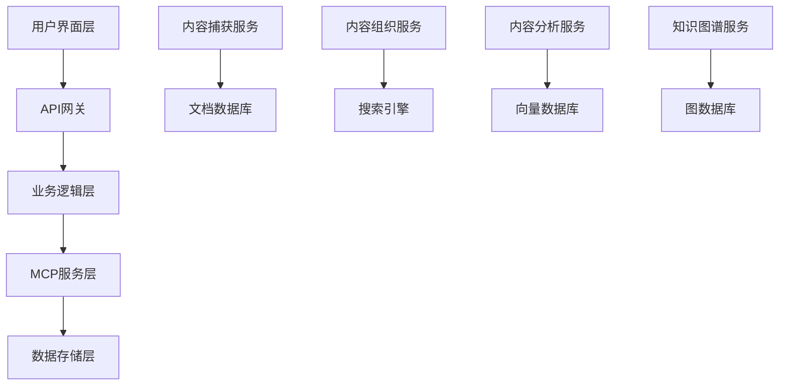

---
project_overview:
  vision: "Enable individuals to build and maintain a comprehensive second brain"
  scope: "Personal knowledge management system using MCP atomic services"
  success_metrics:
    - Knowledge retention improvement
    - Faster information retrieval
    - Increased creative output
    - Reduced cognitive load
---

# BASB Requirements Specification v1.0

## 项目概述

### 愿景声明
构建一个AI驱动的个人知识管理系统，实现Tiago Forte的Building a Second Brain (BASB)方法论，通过MCP原子服务架构，为用户提供智能化的知识捕获、组织、提炼和表达能力。

### 项目范围
- **核心用户群体**: 知识工作者、研究人员、学生、内容创作者
- **技术架构**: 基于MCP (Model Context Protocol) 原子服务的分布式系统
- **实施阶段**: Milestone 1 - 概念验证阶段
- **交付时间**: 4-6周开发周期

### 成功指标
- 知识保留率提升40%
- 信息检索速度提升70%
- 创意产出增加50%
- 认知负担减轻60%

## 动态用户上下文系统需求

### Epic 5: 动态用户画像与个性化系统

#### 5.1 多维度用户画像框架

**基础信息维度**
- 个人基本信息（年龄、职业、教育背景、工作经验）
- 专业技能树（技术栈、工具熟练度、认证资质）
- 兴趣偏好（学习主题、内容类型、阅读习惯）
- 认知风格（学习方式、思维模式、信息处理偏好）

**能力评估维度**
- 知识领域专业度评分
- 学习速度和理解能力
- 创新思维和问题解决能力
- 协作和沟通能力

**价值观和目标维度**
- 职业发展目标和路径规划
- 个人价值观和工作理念
- 短期和长期学习目标
- 成就动机和驱动因素

**行为模式维度**
- 工作时间和效率模式
- 内容消费习惯（阅读、观看、听取）
- 知识分享和协作模式
- 决策风格和风险偏好

#### 5.2 上下文收集策略

**主动冷启动策略**
- 结构化问卷调研（职业背景、技能评估、学习偏好）
- 专业能力测评（技术测试、认知风格评估）
- 目标设定向导（短期目标、长期规划、优先级排序）
- 样本内容偏好测试（推荐不同类型内容，收集反馈）

**被动数字足迹分析**
- 工作行为分析（项目参与、代码提交、文档编写）
- 学习偏好挖掘（阅读完成率、停留时间、重复访问）
- 社交网络分析（协作关系、影响力、专业声誉）
- 内容创作模式（写作风格、主题偏好、发布频率）

#### 5.3 动态更新机制

**多层次感知系统**
- 环境变化检测器（职业变动、技能提升、兴趣转移）
- 社交网络变化监控（新的协作关系、专业圈子扩展）
- 技能成长追踪器（项目成果、学习内容、同行反馈）
- 目标演进分析（优先级变化、新目标设定、完成情况）

**智能更新触发器**
- 主动触发：月度/季度/年度回顾（AI辅助分析）
- 被动触发：异常检测、内容主题漂移、社交网络变化、成就里程碑
- 上下文版本管理：用户画像快照、变更日志、成长轨迹对比分析

#### 5.4 个性化应用机制

**个性化内容推荐**
- 基于当前需求的内容匹配
- 成长轨迹导向的学习路径个性化
- 同行洞察和最佳实践推荐
- 自适应学习路径个性化

**智能工作助手**
- 上下文感知帮助（利用过往经验、适用技能、知识缺口识别、专家联系建议）
- 自适应沟通风格（正式/非正式、技术/非技术、详细/简洁）

**反馈优化循环**
- 隐式反馈收集（阅读完成率、搜索细化、推荐点击率等使用信号）
- 显式反馈机制（微反馈、深度反馈、画像纠正提示）

#### 5.5 技术实现架构

**用户画像存储**
```yaml
user_profile_schema:
  basic_info:
    demographics: {age_range, profession, education, experience_years}
    contact_preferences: {communication_style, notification_frequency}
  
  skills_capabilities:
    technical_skills: [{skill_name, proficiency_level, last_updated, evidence}]
    soft_skills: [{skill_name, self_assessment, peer_feedback, growth_trend}]
    certifications: [{name, issuer, date, expiry, verification_link}]
  
  preferences:
    learning_style: {visual, auditory, kinesthetic, reading_writing}
    content_preferences: {format, length, complexity, topics}
    work_patterns: {peak_hours, collaboration_style, decision_making}
  
  context:
    current_projects: [{name, role, timeline, priority, skills_used}]
    goals: [{type, description, timeline, success_metrics, progress}]
    interests: [{topic, intensity, trend, related_skills}]
  
  behavioral_patterns:
    content_consumption: {reading_speed, completion_rate, engagement_patterns}
    knowledge_sharing: {frequency, formats, audience, feedback_received}
    collaboration: {team_size_preference, communication_frequency, leadership_style}
  
  change_indicators:
    skill_growth: [{skill, growth_rate, evidence, peer_validation}]
    interest_evolution: [{topic, trend_direction, confidence_level}]
    goal_progression: [{goal_id, completion_percentage, timeline_adherence}]
```

**更新触发引擎**
- 时间基础触发器（定期回顾、里程碑检查）
- 事件基础触发器（项目完成、技能认证、角色变更）
- 模式基础触发器（行为异常、兴趣漂移、效率变化）
- 反馈基础触发器（用户主动更新、同行反馈、系统推荐准确性）

#### 5.6 实施路线图

**第一阶段：基础画像构建（2周）**
- 实现结构化用户信息收集
- 建立基础画像数据模型
- 开发简单的偏好学习机制

**第二阶段：智能分析能力（3周）**
- 集成AI分析引擎
- 实现行为模式识别
- 开发个性化推荐算法

**第三阶段：动态更新机制（2周）**
- 实现自动触发更新系统
- 建立画像版本管理
- 开发成长轨迹分析

**第四阶段：反馈优化循环（1周）**
- 实现多层次反馈收集
- 优化推荐准确性
- 建立持续改进机制

**预期成果**
- 短期：基础个性化推荐，用户满意度提升30%
- 中期：智能学习路径规划，学习效率提升50%
- 长期：深度个性化知识助手，认知负担减轻40%

## CODE框架需求分解

### 1. Capture (捕获) 需求

#### 1.1 功能需求

**多源内容捕获**
- **网页内容**: 支持浏览器插件一键保存，自动提取标题、正文、元数据
- **文档处理**: 支持PDF、Word、Markdown等格式的自动解析和内容提取
- **代码仓库**: 从GitHub等代码托管平台提取代码注释、README、文档
- **社交媒体**: 支持Twitter、微信公众号等平台的内容抓取
- **语音转录**: 会议录音、播客、语音备忘录的自动转文字
- **图像识别**: 手写笔记、白板、书籍页面的OCR识别

**自动化元数据提取**
- 内容来源和时间戳
- 作者信息和可信度评估
- 内容类型和格式标识
- 语言检测和编码识别
- 内容长度和复杂度评估

**格式标准化**
- 统一的Markdown格式输出
- 结构化数据提取（标题、列表、引用）
- 链接和引用的标准化处理
- 图片和媒体文件的本地化存储

#### 1.2 非功能需求
- **实时处理**: 内容捕获后5秒内完成初步处理
- **高可用性**: 99.9%的服务可用时间
- **格式支持**: 支持50+种常见文件格式
- **并发处理**: 支持100个并发捕获请求

#### 1.3 支持的内容源
```yaml
web_sources:
  - 网页文章和博客
  - 在线文档和PDF
  - 视频平台字幕
  - 社交媒体内容

file_sources:
  - PDF文档
  - Office文档 (Word, PowerPoint, Excel)
  - 纯文本和Markdown文件
  - 代码文件和注释

media_sources:
  - 音频文件 (MP3, WAV, M4A)
  - 图片文件 (JPG, PNG, PDF扫描件)
  - 视频文件 (MP4, AVI - 提取音频)

api_sources:
  - GitHub仓库
  - Obsidian笔记
  - 趋势内容平台
  - RSS订阅源
```

### 2. Organize (组织) 需求

#### 2.1 PARA方法实现

**Projects (项目)**
- 定义: 有明确截止日期和具体成果的工作
- 特征: 时间限定、结果导向、可衡量
- 自动识别: 基于关键词和时间线的项目内容自动归类
- 状态管理: 进行中、已完成、暂停、取消

**Areas (领域)**
- 定义: 需要持续维护的责任和标准
- 特征: 持续性、维护性、标准化
- 分类体系: 工作、健康、财务、人际关系、个人发展
- 动态调整: 基于用户行为和兴趣变化的自动调整

**Resources (资源)**
- 定义: 未来可能有用的参考主题
- 特征: 参考性、潜在价值、主题聚焦
- 智能分类: 基于内容语义的自动主题聚类
- 价值评估: 基于访问频率和引用次数的价值评分

**Archive (归档)**
- 定义: 来自其他三个类别的非活跃项目
- 特征: 历史价值、完成状态、低频访问
- 自动归档: 基于时间和活跃度的自动归档规则
- 检索优化: 全文搜索和标签检索支持

#### 2.2 搜索和过滤需求

**全文搜索**
- 支持中英文混合搜索
- 模糊匹配和同义词扩展
- 搜索结果相关性排序
- 搜索历史和建议

**标签系统**
- 自动标签生成基于内容分析
- 手动标签管理和层级结构
- 标签权重和重要性评分
- 标签关联和推荐

**语义搜索**
- 基于向量嵌入的语义相似性搜索
- 概念级别的内容匹配
- 跨语言语义搜索支持
- 上下文感知的搜索结果

**高级过滤**
- 时间范围过滤
- 内容类型过滤
- 来源平台过滤
- 重要性级别过滤
- 自定义属性过滤

#### 2.3 分类和标签系统

**自动分类算法**
```python
# 分类决策流程
def classify_content(content):
    # 1. 时间敏感性分析
    if has_deadline(content):
        return "Projects"
    
    # 2. 持续性责任识别
    if is_ongoing_responsibility(content):
        return "Areas"
    
    # 3. 参考价值评估
    if is_reference_material(content):
        return "Resources"
    
    # 4. 默认归类
    return "Resources"
```

**智能标签生成**
- 基于TF-IDF的关键词提取
- 命名实体识别 (人名、地名、组织)
- 主题建模和概念抽取
- 情感和观点标签

### 3. Distill (提炼) 需求

#### 3.1 渐进式总结需求

**多层次摘要**
- **一句话摘要**: 核心观点的极简表达
- **段落摘要**: 主要内容的结构化概述
- **详细摘要**: 包含关键细节的完整总结
- **执行摘要**: 面向行动的要点提取

**AI增强的内容提炼**
- 自动识别关键观点和论据
- 提取可执行的行动项
- 识别需要进一步研究的问题
- 发现内容中的模式和趋势

**渐进式精炼流程**
```yaml
refinement_stages:
  stage_1: "原始内容导入"
  stage_2: "自动摘要生成"
  stage_3: "关键点高亮"
  stage_4: "个人注释添加"
  stage_5: "连接相关内容"
  stage_6: "最终精炼版本"
```

#### 3.2 知识连接和关联

**双向链接系统**
- 自动发现内容间的引用关系
- 概念级别的语义关联
- 时间序列上的知识演化
- 跨领域的知识迁移

**知识图谱构建**
- 实体关系抽取和建模
- 概念层次结构构建
- 知识演化路径追踪
- 知识缺口识别

**智能关联推荐**
- 基于内容相似性的推荐
- 基于用户行为的协同过滤
- 基于知识图谱的路径推荐
- 基于时间和上下文的动态推荐

#### 3.3 模板和格式化

**内容模板系统**
```markdown
# 会议纪要模板
## 基本信息
- 时间: {{date}}
- 参与者: {{participants}}
- 主题: {{topic}}

## 关键决策
{{key_decisions}}

## 行动项
{{action_items}}

## 后续跟进
{{follow_ups}}
```

**格式标准化**
- 统一的标题层级结构
- 标准化的引用格式
- 一致的标签和分类体系
- 规范化的元数据格式

### 4. Express (表达) 需求

#### 4.1 多格式输出

**文档格式**
- Markdown原生格式
- PDF报告生成
- Word文档导出
- HTML网页格式
- LaTeX学术格式

**演示格式**
- PowerPoint幻灯片
- 在线演示页面
- 交互式思维导图
- 时间线可视化

**数据格式**
- JSON结构化数据
- CSV表格数据
- XML标准格式
- YAML配置格式

#### 4.2 分享和协作

**权限管理**
- 公开/私有内容控制
- 基于角色的访问权限
- 细粒度的分享设置
- 临时访问链接生成

**协作功能**
- 实时协同编辑
- 评论和反馈系统
- 版本控制和历史追踪
- 冲突解决机制

**发布渠道**
- 个人博客集成
- 社交媒体发布
- 团队知识库同步
- 外部平台API集成

#### 4.3 知识产品化

**内容聚合**
- 主题相关内容的自动聚合
- 跨时间的知识演化展示
- 多角度的观点整合
- 证据链的构建和展示

**智能写作辅助**
- 基于已有知识的写作建议
- 论据和引用的自动推荐
- 结构化大纲的生成
- 风格和语调的一致性检查

## MCP原子服务架构

### 服务分解和边界定义

#### 1. 知识捕获服务 (Knowledge Ingestion Services)

**Web内容捕获服务**
- 职责: 网页内容的抓取和预处理
- 接口: `capture_web_content(url, options)`
- 输出: 标准化的内容对象

**文档解析服务**
- 职责: 各种文档格式的解析和转换
- 接口: `parse_document(file, format)`
- 输出: 结构化的文本内容

**媒体处理服务**
- 职责: 音频、视频、图像的内容提取
- 接口: `process_media(file, type, options)`
- 输出: 转录文本或识别结果

**API集成服务**
- 职责: 第三方平台的数据同步
- 接口: `sync_external_data(platform, credentials)`
- 输出: 标准化的知识项列表

#### 2. 组织管理服务 (Organization Services)

**PARA分类服务**
- 职责: 基于PARA方法的自动分类
- 接口: `classify_content(content, context)`
- 输出: 分类结果和置信度

**标签管理服务**
- 职责: 自动标签生成和管理
- 接口: `generate_tags(content, existing_tags)`
- 输出: 标签列表和权重

**搜索索引服务**
- 职责: 全文搜索和语义搜索的索引构建
- 接口: `build_search_index(content_list)`
- 输出: 搜索索引和元数据

#### 3. 处理分析服务 (Processing Services)

**AI摘要服务**
- 职责: 多层次内容摘要生成
- 接口: `generate_summary(content, level, language)`
- 输出: 不同层次的摘要文本

**关联发现服务**
- 职责: 内容间关联关系的发现
- 接口: `find_connections(content, knowledge_base)`
- 输出: 关联关系图和相似度分数

**洞察生成服务**
- 职责: 深度分析和洞察提取
- 接口: `generate_insights(content_cluster, user_context)`
- 输出: 结构化洞察和行动建议

#### 4. 用户画像服务 (User Profile Services)

**用户画像构建服务**
- 职责: 多维度用户画像的构建和维护
- 接口: `build_user_profile(user_data, behavioral_data)`
- 输出: 结构化用户画像对象

**行为分析服务**
- 职责: 用户行为模式的分析和预测
- 接口: `analyze_behavior(user_actions, time_window)`
- 输出: 行为模式报告和趋势预测

**个性化推荐服务**
- 职责: 基于用户画像的内容推荐
- 接口: `recommend_content(user_profile, content_pool, context)`
- 输出: 个性化推荐列表和推荐理由

**学习路径规划服务**
- 职责: 个性化学习路径的生成和优化
- 接口: `plan_learning_path(user_profile, learning_goals)`
- 输出: 结构化学习路径和里程碑

**上下文更新服务**
- 职责: 用户上下文的动态更新和版本管理
- 接口: `update_user_context(user_id, trigger_event, new_data)`
- 输出: 更新后的用户画像和变更日志
- 接口: `extract_insights(content_set, analysis_type)`
- 输出: 洞察报告和可视化数据

#### 4. 存储管理服务 (Storage Services)

**知识图谱服务**
- 职责: 知识图谱的构建和查询
- 接口: `update_knowledge_graph(entities, relationships)`
- 输出: 图谱更新状态和查询结果

**文档存储服务**
- 职责: 结构化文档的存储和检索
- 接口: `store_document(content, metadata, index)`
- 输出: 存储确认和文档ID

**版本控制服务**
- 职责: 内容版本的管理和追踪
- 接口: `track_version(document_id, changes, user)`
- 输出: 版本历史和差异对比

#### 5. 表达输出服务 (Presentation Services)

**多格式渲染服务**
- 职责: 内容的多格式转换和渲染
- 接口: `render_content(content, format, template)`
- 输出: 指定格式的文档或数据

**分享协作服务**
- 职责: 内容分享和协作功能
- 接口: `create_share_link(content_id, permissions)`
- 输出: 分享链接和访问控制设置

**发布集成服务**
- 职责: 外部平台的内容发布
- 接口: `publish_to_platform(content, platform, settings)`
- 输出: 发布状态和外部链接

### 服务间通信协议

**标准化数据格式**
```json
{
  "knowledge_item": {
    "id": "uuid",
    "title": "string",
    "content": "string",
    "content_type": "text|markdown|code|image|audio",
    "source": {
      "platform": "string",
      "url": "string",
      "author": "string",
      "timestamp": "iso8601"
    },
    "metadata": {
      "language": "string",
      "tags": ["string"],
      "category": "projects|areas|resources|archive",
      "importance": "number",
      "difficulty": "number"
    },
    "processing": {
      "summary": "string",
      "key_points": ["string"],
      "entities": ["object"],
      "connections": ["object"]
    }
  }
}
```

**事件驱动架构**
```yaml
events:
  content_captured:
    trigger: "新内容捕获完成"
    subscribers: ["分类服务", "标签服务", "索引服务"]
  
  content_classified:
    trigger: "内容分类完成"
    subscribers: ["摘要服务", "关联服务"]
  
  insights_generated:
    trigger: "洞察生成完成"
    subscribers: ["通知服务", "推荐服务"]
```

## 用户故事和验收标准

### Epic 1: 智能内容捕获

**用户故事 1.1**: 网页内容一键保存
- **作为** 知识工作者
- **我希望** 能够一键保存网页内容到我的第二大脑
- **以便** 快速收集有价值的信息而不中断当前工作流

**验收标准**:
- [ ] 浏览器插件能够识别并提取网页主要内容
- [ ] 自动生成标题、摘要和标签
- [ ] 保存时间少于3秒
- [ ] 支持批量保存多个标签页
- [ ] 能够处理动态加载的内容

**用户故事 1.2**: 文档智能解析
- **作为** 研究人员
- **我希望** 上传PDF文档后能自动提取关键信息
- **以便** 快速了解文档内容并建立知识连接

**验收标准**:
- [ ] 支持PDF、Word、PowerPoint等常见格式
- [ ] 自动识别文档结构（标题、段落、列表）
- [ ] 提取图表和表格中的文字信息
- [ ] 生成文档摘要和关键词
- [ ] 识别引用和参考文献

### Epic 2: 智能内容组织

**用户故事 2.1**: PARA自动分类
- **作为** 个人知识管理者
- **我希望** 新添加的内容能够自动按照PARA方法分类
- **以便** 保持知识库的有序组织而无需手动整理

**验收标准**:
- [ ] 能够识别项目相关内容（有截止日期的任务）
- [ ] 能够识别领域相关内容（持续关注的主题）
- [ ] 能够识别资源类内容（参考材料）
- [ ] 分类准确率达到85%以上
- [ ] 提供分类建议的置信度评分

**用户故事 2.2**: 智能标签生成
- **作为** 内容创作者
- **我希望** 系统能够自动为我的内容生成相关标签
- **以便** 提高内容的可发现性和关联性

**验收标准**:
- [ ] 基于内容语义生成5-10个相关标签
- [ ] 标签具有层次结构（主标签和子标签）
- [ ] 能够学习用户的标签偏好
- [ ] 支持手动调整和自定义标签
- [ ] 标签相关性评分达到80%以上

### Epic 3: 智能内容提炼

**用户故事 3.1**: 渐进式摘要
- **作为** 学习者
- **我希望** 能够获得不同详细程度的内容摘要
- **以便** 根据需要快速了解或深入学习

**验收标准**:
- [ ] 提供一句话、一段话、详细三个层次的摘要
- [ ] 摘要保持原文的核心观点
- [ ] 支持中英文内容的摘要生成
- [ ] 摘要生成时间少于10秒
- [ ] 用户满意度评分达到4.0/5.0以上

**用户故事 3.2**: 知识关联发现
- **作为** 研究人员
- **我希望** 系统能够自动发现不同内容之间的关联
- **以便** 建立完整的知识网络和发现新的洞察

**验收标准**:
- [ ] 能够识别概念级别的语义关联
- [ ] 能够发现时间序列上的知识演化
- [ ] 能够识别跨领域的知识迁移
- [ ] 关联推荐的准确率达到75%以上
- [ ] 提供关联强度的量化评分

### Epic 4: 智能内容表达

**用户故事 4.1**: 多格式导出
- **作为** 知识分享者
- **我希望** 能够将我的知识内容导出为不同格式
- **以便** 在不同场景下分享和使用

**验收标准**:
- [ ] 支持Markdown、PDF、Word、HTML格式导出
- [ ] 保持原有的格式和结构
- [ ] 支持批量导出多个文档
- [ ] 导出文件大小合理（压缩率>50%）
- [ ] 导出时间与内容量成正比且合理

**用户故事 4.2**: 智能写作辅助
- **作为** 内容创作者
- **我希望** 在写作时能够获得相关内容的推荐
- **以便** 提高写作效率和内容质量

**验收标准**:
- [ ] 基于当前写作内容推荐相关资料
- [ ] 提供论据和引用的自动建议
- [ ] 生成结构化的文章大纲
- [ ] 检查内容的逻辑一致性
- [ ] 推荐内容的相关性达到80%以上

## 非功能需求

### 性能需求

**响应时间**
- 内容捕获: < 5秒
- 搜索查询: < 2秒
- 摘要生成: < 10秒
- 页面加载: < 3秒

**吞吐量**
- 并发用户: 1000+
- 并发请求: 10000+/分钟
- 数据处理: 1GB/小时

**可扩展性**
- 水平扩展支持
- 微服务架构
- 负载均衡
- 自动伸缩

### 可用性需求

**系统可用性**
- 服务可用性: 99.9%
- 计划内维护: < 4小时/月
- 故障恢复时间: < 30分钟

**数据可靠性**
- 数据备份: 每日自动备份
- 数据恢复: RTO < 1小时, RPO < 15分钟
- 数据一致性: 强一致性保证

### 安全需求

**数据安全**
- 端到端加密
- 访问权限控制
- 数据脱敏处理
- 安全审计日志

**隐私保护**
- 用户数据隔离
- 匿名化处理
- GDPR合规
- 数据删除权

### 兼容性需求

**平台兼容**
- Web浏览器: Chrome, Firefox, Safari, Edge
- 操作系统: Windows, macOS, Linux
- 移动设备: iOS, Android

**集成兼容**
- Obsidian插件
- GitHub API
- 主流云存储服务
- 第三方AI服务

## 技术约束和依赖

### 技术栈约束

**后端技术**
- 编程语言: TypeScript/Node.js
- 框架: Express.js
- 数据库: MongoDB + Neo4j
- 消息队列: Redis

**前端技术**
- 框架: React + TypeScript
- 状态管理: Redux Toolkit
- UI组件: Material-UI
- 构建工具: Vite

**AI服务**
- OpenAI GPT-4 API
- 向量数据库: Pinecone
- 语音识别: Whisper API
- 图像识别: GPT-4V

### 外部依赖

**第三方服务**
- GitHub API (代码仓库集成)
- Obsidian API (笔记同步)
- 云存储服务 (文件存储)
- CDN服务 (内容分发)

**开源组件**
- 文档解析: pdf-parse, mammoth
- 自然语言处理: natural, compromise
- 图像处理: sharp, tesseract.js
- 数据可视化: D3.js, vis.js

### 部署约束

**基础设施**
- 容器化部署: Docker + Kubernetes
- 云平台: AWS/Azure/GCP
- 监控系统: Prometheus + Grafana
- 日志系统: ELK Stack

**环境要求**
- Node.js >= 18.0.0
- MongoDB >= 5.0
- Redis >= 6.0
- Neo4j >= 4.0

## 风险分析和缓解策略

### 技术风险

**AI服务依赖风险**
- 风险: OpenAI API限制或服务中断
- 缓解: 多AI服务提供商备选方案
- 监控: API调用成功率和响应时间

**数据处理性能风险**
- 风险: 大文件处理导致系统性能下降
- 缓解: 异步处理和分批处理机制
- 监控: 处理队列长度和处理时间

**数据一致性风险**
- 风险: 分布式系统的数据一致性问题
- 缓解: 事务管理和最终一致性设计
- 监控: 数据同步状态和冲突检测

### 业务风险

**用户采用风险**
- 风险: 用户学习成本高，采用率低
- 缓解: 简化用户界面，提供详细教程
- 监控: 用户活跃度和功能使用率

**竞争风险**
- 风险: 市场上出现更优秀的竞品
- 缓解: 持续创新和用户反馈驱动开发
- 监控: 竞品分析和市场趋势

**数据隐私风险**
- 风险: 用户数据泄露或滥用
- 缓解: 严格的安全措施和隐私保护
- 监控: 安全审计和合规检查

### 项目风险

**进度延期风险**
- 风险: 开发复杂度超出预期
- 缓解: 敏捷开发和MVP优先策略
- 监控: 里程碑进度和燃尽图

**团队协作风险**
- 风险: 团队成员技能不匹配或沟通不畅
- 缓解: 技能培训和定期沟通机制
- 监控: 团队效率和代码质量指标

**需求变更风险**
- 风险: 需求频繁变更影响开发进度
- 缓解: 需求冻结期和变更控制流程
- 监控: 需求变更频率和影响评估

## 验证和测试策略

### 功能测试

**单元测试**
- 覆盖率目标: 80%+
- 测试框架: Jest + Testing Library
- 自动化执行: CI/CD集成

**集成测试**
- API接口测试
- 数据库集成测试
- 第三方服务集成测试
- 端到端工作流测试

**用户验收测试**
- 基于用户故事的测试用例
- 真实用户场景模拟
- 可用性测试
- A/B测试

### 性能测试

**负载测试**
- 正常负载下的性能表现
- 峰值负载下的系统稳定性
- 长时间运行的稳定性测试

**压力测试**
- 系统极限负载测试
- 故障恢复能力测试
- 资源耗尽场景测试

### 安全测试

**渗透测试**
- SQL注入防护测试
- XSS攻击防护测试
- 身份认证安全测试

**数据安全测试**
- 数据加密有效性测试
- 访问权限控制测试
- 数据备份恢复测试

## 项目里程碑和交付计划

### Milestone 1: 基础架构 (第1-2周)

**交付物**
- MCP服务框架搭建
- 基础数据模型定义
- 核心API接口设计
- 开发环境配置

**验收标准**
- 所有MCP服务接口定义完成
- 基础的CRUD操作可用
- 单元测试覆盖率达到70%
- 技术文档完整

### Milestone 2: 核心功能 (第3-4周)

**交付物**
- 内容捕获功能实现
- PARA分类系统实现
- 基础搜索功能实现
- 简单的Web界面

**验收标准**
- 支持3种以上内容源的捕获
- PARA自动分类准确率达到80%
- 搜索响应时间小于2秒
- 基本用户操作流程可用

### Milestone 3: AI增强 (第5-6周)

**交付物**
- AI摘要生成功能
- 智能标签系统
- 知识关联发现
- 内容推荐系统

**验收标准**
- 摘要质量用户满意度达到4.0/5.0
- 标签相关性达到80%
- 关联推荐准确率达到75%
- AI功能响应时间合理

### Milestone 4: 系统集成 (第7-8周)

**交付物**
- 完整的用户界面
- 多格式导出功能
- 用户权限管理
- 系统监控和日志

**验收标准**
- 所有用户故事验收通过
- 系统性能指标达标
- 安全测试通过
- 用户文档完整

## 用户故事补充 - 动态用户上下文系统

### Epic 5: 动态用户画像与个性化系统用户故事

#### 5.1 用户画像构建

**US-5.1.1: 初始画像设置**
- **作为** 新用户
- **我希望** 通过简单的问卷快速建立我的基础画像
- **以便** 系统能够为我提供个性化的服务
- **验收标准**:
  - 问卷完成时间不超过10分钟
  - 涵盖职业背景、技能水平、学习偏好、目标设定
  - 支持跳过选项，后续可补充
  - 提供画像预览和编辑功能

**US-5.1.2: 技能评估**
- **作为** 知识工作者
- **我希望** 系统能够评估我的专业技能水平
- **以便** 获得匹配我能力的内容推荐
- **验收标准**:
  - 支持自我评估和客观测试两种方式
  - 技能树可视化展示
  - 技能水平动态更新
  - 与同行对比功能

**US-5.1.3: 学习风格识别**
- **作为** 学习者
- **我希望** 系统识别我的学习风格和偏好
- **以便** 获得最适合我的学习内容和方式
- **验收标准**:
  - 支持视觉、听觉、动手等多种学习风格
  - 内容格式偏好识别（文字、视频、音频、图表）
  - 学习时间和节奏偏好
  - 难度递进偏好设置

#### 5.2 动态更新机制

**US-5.2.1: 自动行为分析**
- **作为** 系统用户
- **我希望** 系统自动分析我的使用行为
- **以便** 不断优化个性化推荐的准确性
- **验收标准**:
  - 阅读完成率、停留时间、重复访问等行为指标收集
  - 搜索关键词和内容偏好分析
  - 知识创作和分享模式识别
  - 协作和社交行为分析

**US-5.2.2: 智能更新提醒**
- **作为** 长期用户
- **我希望** 系统提醒我更新个人画像
- **以便** 保持推荐内容的相关性
- **验收标准**:
  - 基于行为变化的智能提醒
  - 定期回顾提醒（月度/季度）
  - 重大事件触发更新（职业变动、项目完成）
  - 更新建议和引导流程

**US-5.2.3: 成长轨迹追踪**
- **作为** 追求成长的用户
- **我希望** 看到我的知识和技能成长轨迹
- **以便** 了解自己的进步和规划未来发展
- **验收标准**:
  - 技能成长可视化图表
  - 知识领域扩展时间线
  - 学习成果和里程碑记录
  - 成长速度和趋势分析

#### 5.3 个性化应用

**US-5.3.1: 智能内容推荐**
- **作为** 知识消费者
- **我希望** 获得高度相关的内容推荐
- **以便** 高效地获取有价值的信息
- **验收标准**:
  - 推荐准确率达到80%以上
  - 支持多种推荐理由（兴趣匹配、技能提升、项目相关）
  - 推荐多样性和新颖性平衡
  - 用户反馈和推荐优化循环

**US-5.3.2: 个性化学习路径**
- **作为** 有明确学习目标的用户
- **我希望** 获得个性化的学习路径规划
- **以便** 系统性地提升特定领域的知识和技能
- **验收标准**:
  - 基于当前水平和目标的路径规划
  - 学习资源的优先级排序
  - 进度跟踪和调整机制
  - 学习效果评估和反馈

**US-5.3.3: 上下文感知助手**
- **作为** 工作中的用户
- **我希望** 获得基于当前上下文的智能帮助
- **以便** 更高效地完成工作任务
- **验收标准**:
  - 基于当前项目和任务的相关内容推荐
  - 历史经验和最佳实践提醒
  - 专家联系和协作建议
  - 知识缺口识别和补充建议

#### 5.4 反馈优化

**US-5.4.1: 推荐反馈**
- **作为** 系统用户
- **我希望** 能够对推荐内容提供反馈
- **以便** 帮助系统改进推荐质量
- **验收标准**:
  - 简单的点赞/点踩反馈机制
  - 详细的反馈选项（不相关、已知、太难、太简单）
  - 反馈对推荐算法的实时影响
  - 反馈统计和效果展示

**US-5.4.2: 画像校正**
- **作为** 注重隐私的用户
- **我希望** 能够查看和修正系统对我的理解
- **以便** 确保个人信息的准确性和隐私保护
- **验收标准**:
  - 画像信息的透明展示
  - 一键修正错误信息
  - 隐私设置和数据控制
  - 画像删除和重置选项

**US-5.4.3: 效果评估**
- **作为** 追求效率的用户
- **我希望** 了解个性化功能对我的帮助程度
- **以便** 决定如何更好地使用系统
- **验收标准**:
  - 个性化效果的量化指标
  - 使用前后的效率对比
  - 个性化功能的价值报告
  - 优化建议和使用指导

### 非功能需求补充

#### 个性化准确性要求
- 内容推荐准确率: > 80%
- 学习路径匹配度: > 85%
- 用户满意度: > 4.2/5.0
- 推荐多样性指数: > 0.7

#### 更新响应时间要求
- 行为数据处理延迟: < 5分钟
- 画像更新响应时间: < 30秒
- 推荐刷新频率: 实时到24小时
- 大规模更新处理: < 2小时

#### 隐私保护要求
- 数据加密: AES-256标准
- 访问控制: 基于角色的细粒度权限
- 数据匿名化: 支持完全匿名模式
- 合规性: 符合GDPR和相关隐私法规

## 成功标准和KPI

### 用户体验指标

**易用性指标**
- 新用户上手时间: < 30分钟
- 用户满意度评分: > 4.0/5.0
- 功能发现率: > 80%
- 用户留存率: > 70% (30天)

**效率指标**
- 知识捕获效率提升: > 50%
- 信息检索速度提升: > 70%
- 内容组织时间减少: > 60%
- 知识复用率提升: > 40%

### 技术性能指标

**系统性能**
- 页面加载时间: < 3秒
- API响应时间: < 2秒
- 系统可用性: > 99.9%
- 错误率: < 0.1%

**AI功能质量**
- 内容分类准确率: > 85%
- 摘要质量评分: > 4.0/5.0
- 标签相关性: > 80%
- 关联推荐准确率: > 75%

### 业务价值指标

**知识管理效果**
- 知识保留率提升: > 40%
- 创意产出增加: > 50%
- 决策质量改善: > 30%
- 学习效率提升: > 60%

**用户增长指标**
- 月活跃用户增长: > 20%
- 用户推荐率: > 60%
- 付费转化率: > 15%
- 用户生命周期价值: 持续增长

---

## 附录

### A. 竞品分析

**Obsidian**
- 优势: 强大的链接功能，本地存储，插件生态
- 劣势: 学习曲线陡峭，AI功能有限
- 差异化: 我们提供更智能的自动化和AI增强

**Notion**
- 优势: 一体化工作空间，协作功能强
- 劣势: 性能问题，知识连接能力弱
- 差异化: 我们专注于知识管理和智能连接

**Roam Research**
- 优势: 双向链接，块级引用
- 劣势: 界面复杂，价格昂贵
- 差异化: 我们提供更直观的界面和更智能的功能

### B. 技术架构图



### C. 数据模型设计

**用户上下文模型**
```typescript
interface UserContext {
  userId: string;
  profile: UserProfile;
  preferences: UserPreferences;
  behavior: BehaviorPattern;
  knowledge: KnowledgeDomain[];
  goals: Goal[];
  currentActivity: Activity;
  metadata: ContextMetadata;
}
```

**知识项模型**
```typescript
interface KnowledgeItem {
  id: string;
  title: string;
  content: string;
  contentType: ContentType;
  source: ContentSource;
  metadata: ItemMetadata;
  processing: ProcessingResult;
  connections: Connection[];
  tags: Tag[];
  category: PARACategory;
}
```

### D. API接口规范

**RESTful API设计**
```yaml
paths:
  /api/v1/knowledge:
    get:
      summary: 获取知识项列表
      parameters:
        - name: category
          in: query
          schema:
            type: string
            enum: [projects, areas, resources, archive]
    post:
      summary: 创建新的知识项
      requestBody:
        content:
          application/json:
            schema:
              $ref: '#/components/schemas/KnowledgeItem'
```

---

## 版本历史

### v1.1 - 2024-12-19
- **重大更新**: 新增动态用户上下文系统需求
- **新增内容**: Epic 5 - 动态用户画像与个性化系统
- **扩展服务**: 5个新的MCP用户画像服务
- **补充用户故事**: 13个新用户故事
- **非功能需求**: 个性化准确性、响应时间、隐私保护要求
- **更新原因**: 基于`动态用户上下文系统设计.md`的需求分析

### v1.0 - 2024-12-19
- **初始版本**: 基础BASB系统需求规格
- **核心内容**: CODE框架需求分解
- **服务架构**: 基础MCP原子服务定义
- **用户故事**: 核心功能用户故事

---

**当前版本**: v1.1  
**创建日期**: 2024-12-19  
**最后更新**: 2024-12-19  
**负责人**: BASB产品经理  
**审核状态**: 待架构师审核  
**更新内容**: 动态用户上下文系统完整需求补充